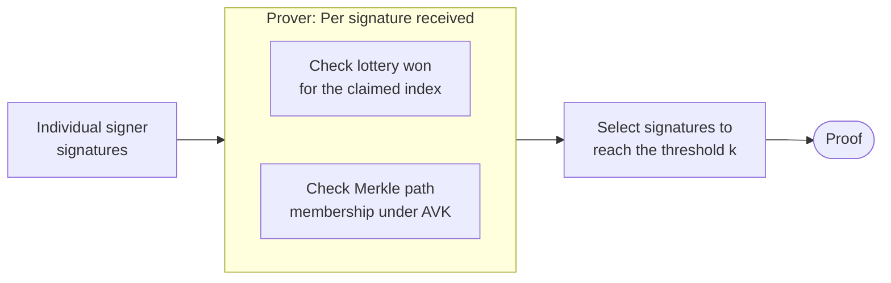
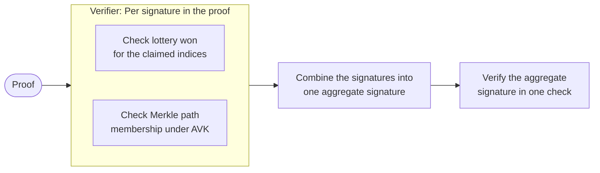

# Concatenation

The concatenation method for aggregating the signatures is the most straighforward one. It uses BLS signatures for its batching capability in order to have faster verification. The prover checks the validity of the signatures received and that they correctly won the lottery with their indices. It then verifies that the leaf does belong to the [Merkle tree](../../../../glossary.md#merkle-tree) using the Merkle root and the Merkle path. Finally, the prover selects enough valid signatures to reach the threshold of `k` valid indices, and packs them together in one structure to create the proof.

## How the proof is verified

To verify the proof, a verifier does the same checks as the prover: that each of signatures won its lottery for the claimed indices, and that each corresponding leaf belongs to the Merkle tree under the aggregate verification key. Since the signatures are BLS signatures, all the signatures can be combined into a single aggregate signature and verified together in one check, rather than individually.

