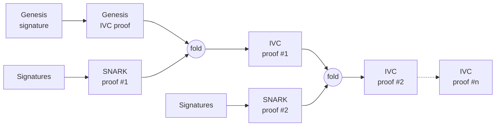
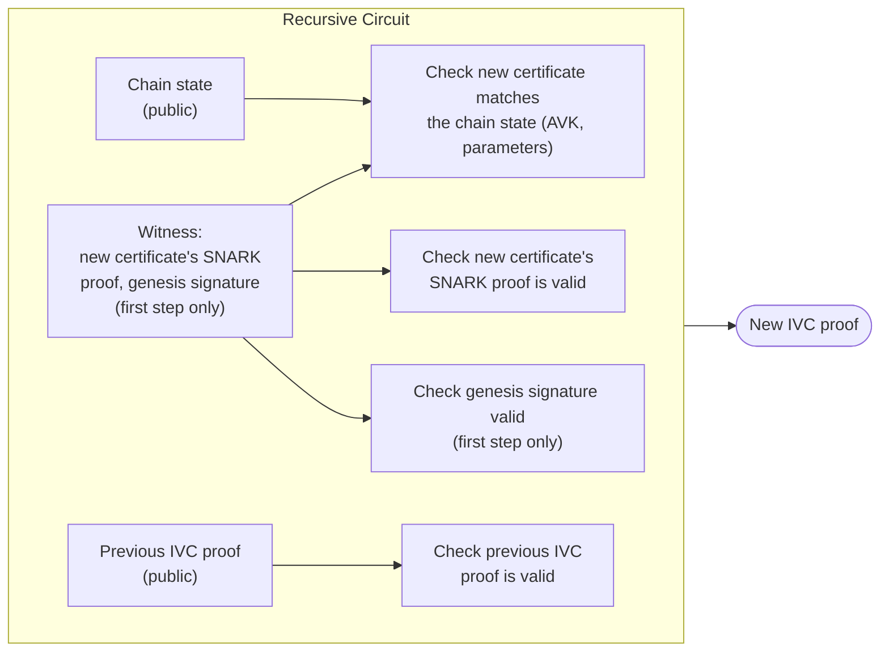

# Recursive SNARK

:::danger

This aggregation flavor is still unstable.

:::

A recursive SNARK is a SNARK whose circuit performs the verification of other SNARK proofs, including itself. Using such a SNARK, it is possible to build a circuit that will perform the verification of both the non-recursive SNARK proof and the recursive SNARK proof. The recursive SNARK uses an IVC (incrementally verifiable computation) to build a proof step by step. From there, one can create a chain of proofs such that each step verifies that the chain is valid and that the newly added proof is valid.

This can be used to aggregate certificates into a single proof by using the SNARK proofs of the certificates, going back to the genesis certificate. The proof attests to the validity of all accumulated SNARK proofs as well as the links between each certificate of the chain. Checking that this proof is valid is equivalent to checking every certificate in the chain individually, back to genesis, but at the cost of verifying only one proof.

## What the proof attests

Given the chain's current state (the current epoch, its `AVK`, and the protocol parameters) and the previous step's recursive proof, the proof attests that the prover knows a new certificate's SNARK proof such that:

- the new certificate's SNARK proof is valid, and the `AVK` it certifies matches what the previous epoch had already committed to
- the protocol parameters used by the new certificate match the ones fixed for the chain
- the previous step's recursive proof is valid, so this step vouches for the whole chain before it, not just the certificate being added
- at the very first step, a signature over the genesis message is valid under the well-known genesis key, anchoring the chain the same way the genesis certificate does today.

These conditions are encoded in a circuit that generates the proof, and verifying the proof ensures all the conditions, from the current step back to genesis, were met. The circuit is publicly available, so anyone can check exactly which conditions it asserts.

## What is needed to verify a proof

To verify a proof, a verifier needs:

- the recursive proof
- the verification key of the recursive circuit
- the verification key of the non-recursive circuit
- the genesis verification key
- the chain state the proof attests to: the current epoch, its `AVK`, the message being certified, and the protocol parameters
