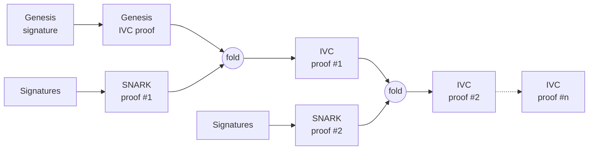
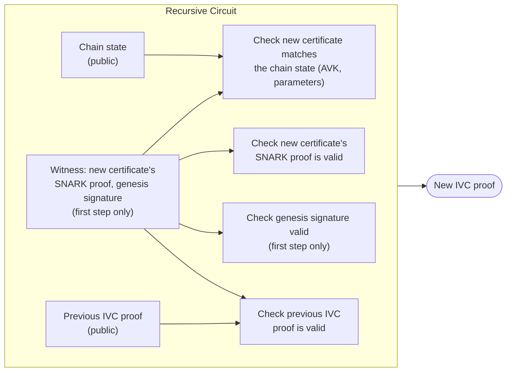

# Recursive SNARK

## Introduction

A recursive SNARK is a SNARK whose circuit performs the verification of other SNARK proofs, including itself. Using such a SNARK, it is possible to build a circuit that will perform the verification of both the non-recursive SNARK proof and the recursive SNARK proof. A recursive SNARK uses an IVC (incrementally verifiable computation) to build a proof step by step. From there, one can create a chain of proof such that each step verifies that the chain is valid and that the new proof added verifies.

This can be used to aggregate certificates using SNARK proof, going back to the genesis certificate, into a single proof. The proof attests to the validity of all accumulated SNARK proofs as well as the link between each certificate of the chain. Checking that this proof is valid is equivalent to checking every certificate in the chain individually, back to genesis, but at the cost of verifying only one proof.



## What the proof attests

Given the chain's current state (the current epoch, its `AVK`, and the protocol parameters in force) and the previous step's recursive proof, the proof attests that the prover knows a new certificate's SNARK proof such that:

- the new certificate's SNARK proof is valid, and the `AVK` it certifies matches what the previous epoch had already committed to
- the protocol parameters used by the new certificate match the ones fixed for the chain
- the previous step's recursive proof is valid, so this step vouches for the whole chain before it, not just the certificate being added
- at the very first step, a signature over the genesis message is valid under the well-known genesis key, anchoring the chain the same way the genesis certificate does today.

These conditions are encoded in a circuit that generates the proof, and verifying the proof ensures all the conditions, from the current step back to genesis, were met. The circuit is publicly available, so anyone can check exactly which conditions it asserts.

<div style={{textAlign: "center"}}>

</div>

## What is needed to verify a proof

To verify a proof, a verifier needs:

- the recursive proof
- the verification key of the recursive circuit
- the chain state the proof attests to: the current epoch, its `AVK`, the message being certified, and the protocol parameters in force

The recursive circuit's verification key is a fixed piece of data, derived from a one-time trusted setup together with the [non recursive SNARK](./non_recursive_SNARK.md)'s own verification key, since each step checks a certificate proof against it. It is fixed for a given circuit and publicly available. The chain state can be recomputed by any party that has followed the chain from genesis, the same way a verifier following `CHAIN_VERIFY` today would.

Because the recursive circuit is built to verify proofs against one specific certificate verification key, changing that key (for example when modifying the SNARK certificate circuit) means starting a new chain from a new genesis certificate rather than continuing the existing one. Since the certificate's verification key depends on the protocol parameters (`k`, `m`, `phi_f`), the same applies to changing those parameters.

## Comparison of the aggregation method

| Method                      | Proof size for the chain                                                                                         |
| --------------------------- | ---------------------------------------------------------------------------------------------------------------- |
| Concatenation               | Grows with the # of signatures in the proofs, and the certificate chain still has to be walked back to genesis |
| Non recursive SNARK           | A few kilobytes per certificate, one certificate per step between target and genesis , independent of `k`        |
| Recursive SNARK | A few kilobytes, independent of `k` and of chain length                                                          |
```
