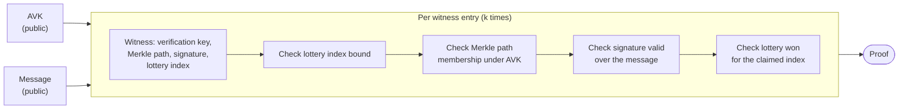

# Non-recursive SNARK

## Introduction

A SNARK certificate is a certificate whose proof is a [SNARK](../../../../glossary.md#snark) attesting that a threshold of signatures were aggregated. It lets a prover verify signatures and aggregate those verifications into a succinct proof. This proof can then be checked by a verifier, confirming that all the aggregated signatures are valid and that they reach the threshold. The verification of this proof is much faster than checking the individual signatures.

## The SNARK certificate circuit

To create a proof, one needs to design a circuit that describes the relation to prove in the form of constraints, for example that the signature of a message is valid given a verification key. In the case of a certificate of the Mithril protocol, one needs to run the verification algorithm of the certificate inside the circuit.

Every check a verifier would otherwise perform by hand on each signature, such as validating the signature itself, confirming the signer is registered by checking its Merkle tree membership, or confirming it won its lottery, becomes a constraint in this circuit. To produce a proof, the prover finds values for every variable in the circuit, called a witness, that satisfy all of these constraints at once. The proof convinces a verifier that such a witness exists, without the verifier needing to see the witness itself or repeat the checks it encodes.

## What the proof attests

Given the aggregate verification key for SNARK (`AVK`), the root of a [Merkle tree](../../../../glossary.md#merkle-tree) committing to the stake and verification key of every registered signer, and the message being certified, the proof attests that the prover knows `k` winning lottery entries such that, for each one:

- the signer's stake and verification key form a leaf of the Merkle tree with root `AVK`, attesting it is properly registered
- the signer's signature over the message is valid under that verification key
- the signer won its lottery for the claimed index
- all `k` claimed indices are distinct, so no lottery win is counted twice.

These conditions are encoded in a circuit that generates the proof, and verifying the proof ensures all the conditions were met. The circuit is publicly available, so anyone can check exactly which conditions it asserts.

## How to verify the proof

To verify a proof, a verifier needs:

- the proof
- the verification key of the circuit used to create the proof
- the `AVK`
- the message

The proof is published by the aggregator once computed. The circuit's verification key is a fixed piece of data, derived from the circuit and a one-time trusted setup, that matches the protocol parameters (`k`, `m`, `phi_f`) used to produce the proof. It is fixed for a given circuit and publicly available. The `AVK` is the root of a Merkle Tree that can be recomputed by any party with access to the list of signers. The message is what is signed by the signers, for example a Cardano database snapshot digest, a stake distribution, or a set of transactions.

## Chaining certificates

A SNARK certificate proves that a single certificate is valid. The [recursive SNARK certificate](./recursive-snark-certificate.md) builds on this: each step of the certificate chain folds in one of these per-certificate proofs, so that a single proof can attest to the validity of the entire chain going back to the genesis certificate.
