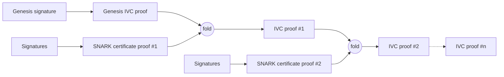

# Recursive SNARK

## Introduction

A recursive SNARK certificate is a certificate whose proof is a SNARK that attests that an entire chain of certificates, going back to the genesis certificate, is valid. A recursive SNARK uses an IVC (incrementally verifiable computation) to build a proof step by step. In this case, it lets a prover verify and accumulate SNARK certificates into a single proof. The proof attests to the validity of all accumulated SNARK certificates as well as the links of the chain they form. Checking that this proof is valid is equivalent to checking every certificate in the chain individually, back to genesis, but at the cost of verifying only one proof.

## What the proof attests

Given the chain's current state (the current epoch, its `AVK`, and the protocol parameters in force) and the previous step's recursive proof, the proof attests that the prover knows a new certificate's SNARK proof such that:

- the new certificate's SNARK proof is valid, and the `AVK` it certifies matches what the previous epoch had already committed to
- the protocol parameters used by the new certificate match the ones fixed for the chain
- the previous step's recursive proof is valid, so this step vouches for the whole chain before it, not just the certificate being added
- at the very first step, a signature over the genesis message is valid under the well-known genesis key, anchoring the chain the same way the genesis certificate does today.

These conditions are encoded in a circuit that generates the proof, and verifying the proof ensures all the conditions, from the current step back to genesis, were met. The circuit is publicly available, so anyone can check exactly which conditions it asserts.

## What is needed to verify a proof

To verify a proof, a verifier needs:

- the recursive proof
- the verification key of the recursive circuit
- the chain state the proof attests to: the current epoch, its `AVK`, the message being certified, and the protocol parameters in force

The recursive proof is published by the aggregator once computed, together with the state it attests to. The recursive circuit's verification key is a fixed piece of data, derived from a one-time trusted setup together with the [SNARK certificate](./snark-certificate.md)'s own verification key, since each step checks a certificate proof against it. It is fixed for a given circuit and publicly available. The chain state can be recomputed by any party that has followed the chain from genesis, the same way a verifier following `CHAIN_VERIFY` today would.

Because the recursive circuit is built to verify proofs against one specific certificate verification key, changing that key (for example when modifying the SNARK certificate circuit) means starting a new chain from a new genesis certificate rather than continuing the existing one. Since the certificate's verification key depends on the protocol parameters (`k`, `m`, `phi_f`), the same applies to changing those parameters.

## The cost of trust

A Cardano full node can already bootstrap in about 20 minutes with Mithril, versus over 24 hours syncing from genesis without it. The table below shows how to improve this even further using non-recursive and recursive SNARK proofs. They give a cheaper way to establish the same guarantee, that the current chain state is genuine, and they lower the cost of trusting it further: the SNARK certificate makes checking a single certificate almost free, and the recursive SNARK certificate makes checking the entire chain, no matter how long it has grown, cost about the same as checking one proof. That matters beyond full nodes: it's what makes verification practical for light clients, mobile wallets, or on-chain checks.

| Method                      | Time to verify the chain                                                                                  | Proof size for the chain                                                                                         | Time to compute a proof                                                            |
| --------------------------- | --------------------------------------------------------------------------------------------------------- | ---------------------------------------------------------------------------------------------------------------- | ---------------------------------------------------------------------------------- |
| Without Mithril             | Proportional to the entire history of the Cardano chain, since every block must be replayed and validated | None: the "proof" is the entire history of blocks since genesis                                                  | No proof produced, each node independently replays the chain                       |
| Concatenation               | Proportional to `k` per certificate and to the number of certificates between the target and genesis      | Grows with `k` (signatures in one certificate), and the certificate chain still has to be walked back to genesis | Negligible: signatures are just packed together, no proof generation               |
| SNARK certificate           | A few milliseconds per proof, one proof per certificate between the target and genesis                    | A few kilobytes per certificate, one certificate per step between target and genesis , independent of `k`        | A few minutes (~5 minutes)                                                         |
| Recursive SNARK certificate | A few milliseconds regardless of chain length                                                             | A few kilobytes, independent of `k` and of chain length                                                          | A few minutes for the certificate proof, plus tens of seconds for the folding step |

