# Part 0 — How to read this book

## What this book is for

Mithril combines individual signatures into an [aggregate signature](#protocol-terms) that clients verify. It supports three [aggregation flavors](#protocol-terms): [concatenation](https://mithril.network/doc/next/mithril/advanced/mithril-protocol/aggregation/concatenation), [non-recursive SNARK](https://mithril.network/doc/next/mithril/advanced/mithril-protocol/aggregation/non-recursive-snark) and [recursive SNARK](https://mithril.network/doc/next/mithril/advanced/mithril-protocol/aggregation/recursive-snark). Concatenation bundles selected signatures; the two [SNARK](https://mithril.network/doc/next/glossary#snark) flavors replace that bundle with a [proof](#proof-system-terms). Concatenation is stable; both SNARK flavors are unstable.

This book covers the two SNARK flavors: how they are built, what they cost, what constrains them, and what their security rests on.

It is written for developers implementing or changing them, and for reviewers and auditors assessing their correctness. It assumes familiarity with Mithril certificates, epochs and stake distributions at the level the [Mithril website](https://mithril.network/doc/) explains them, and no prior knowledge of SNARK proof systems; Part 1 defines the terms it uses.

## Reading paths

The book is ten parts, and no reader needs all of them. These are the routes through it.

| If you want to | Read, in order |
| --- | --- |
| See what the SNARK flavors are and how they fit together | Part 2, then Part 3 |
| Change one of the circuits | Part 3, then Part 4; add Part 5 for recursive changes; then Parts 6, 7 and 8 |
| Review or audit the construction | Part 3, then Parts 4 and 5, then Parts 6, 7 and 9 |
| Operate or roll out a SNARK flavor | Part 2, then Parts 6 and 8 |
| Look up a term | Part 1 |

Three things worth knowing before choosing a route.

**Start with Part 2.** It gives the pipeline as five steps and the architecture around them. Part 3 expands those steps, Parts 4 and 5 specify the circuits inside them, and Parts 6 to 9 cover what they depend on, how they are tested, operated and secured. Part 2 on its own is enough for a working picture of the system.

**Part 4 comes before Part 5.** Five of Part 5's sections mirror Part 4's, and the recursive circuit is described throughout as what it adds to the non-recursive one. Part 5 read alone leaves those five sections without their counterparts.

**Part 1 is a reference.** Its terms are linked from the sections that use them, so a skim is enough on a first pass and it can be consulted from there as needed.

## Contents

- [Part 0 — How to read this book](#part-0--how-to-read-this-book)
- [Part 1 — Glossary and notation](#part-1--glossary-and-notation)
- [Part 2 — Overview and architecture](#part-2--overview-and-architecture)
- [Part 3 — Protocol specification, common to both circuits](#part-3--protocol-specification-common-to-both-circuits)
- [Part 4 — The non-recursive certificate circuit](#part-4--the-non-recursive-certificate-circuit)
- [Part 5 — The recursive circuit](#part-5--the-recursive-circuit)
- [Part 6 — Keys, trusted setup, and circuit identity](#part-6--keys-trusted-setup-and-circuit-identity)
- [Part 7 — Testing strategy](#part-7--testing-strategy)
- [Part 8 — Rollout, compatibility, and operations](#part-8--rollout-compatibility-and-operations)
- [Part 9 — Security](#part-9--security)

## The revision this book describes

Statements about the code are checked against one revision of `main`, named here.

**Baseline: `135243656`, 2026-09-21.**

A page describes what exists at that baseline unless it carries the **In review** marker: implemented in a named open pull request, pinned by its head commit, and not on `main` at the baseline. The marker does not mean approved, nor certain to ship as written.

Where something is built but nothing calls it yet, the page says so. A feature gate is not a marker: whether code is merged and whether a distribution enables it are independent facts, and a page that depends on one states it in prose.

The baseline records the revision checked for this edition. Later changes on `main` may not yet be reflected here, so when a statement does not match the code, check the baseline first.

# Part 1 — Glossary and notation

Terms are grouped by what they belong to, and pages link here on first use.

## Notation

| Symbol | Meaning |
| --- | --- |
| `k` | The quorum: the required number of distinct winning lottery indices for the signed message. One signer may contribute several winning indices. |
| `m` | The number of lottery indices evaluated for each signed message. Indices range from `0` to `m - 1`. |
| `phi_f` | The protocol parameter in the ideal winning probability `1 - (1 - phi_f)^w`. |
| `w` | A signer's stake as a fraction of the total stake of all registered signers. |
| `K` | The base-2 logarithm of the evaluation-domain size: `2^K` rows. The circuit must fit in the usable rows of that domain. Not the degree of a polynomial, and not the number of constraints. Written `K_certificate` and `K_recursive` where both appear on one page. |
| `lambda` | The target approximation precision in bits, written `epsilon = 2^-lambda` in the lottery error analysis. It does not state the security level of the protocol. |

`k` and `K` are different quantities and are always written with the case shown here.

## Protocol terms

| Term | Meaning |
| --- | --- |
| Lottery index | An integer in `0..m` identifying one lottery for a signed message. Different signers can win the same index; that index counts once toward the quorum. |
| Aggregation flavor | One of the three ways Mithril builds an aggregate signature: concatenation, non-recursive SNARK, recursive SNARK. |
| Aggregate signature | The artifact a flavor produces for clients to verify: a bundle of selected signatures, or a SNARK proof, together with the data that format requires. |
| Certificate chain | See the [website](https://mithril.network/doc/next/mithril/advanced/mithril-protocol/certificates). |
| Aggregate verification key | The membership-tree commitment and total registered stake that a proof system verifies an aggregate against. Distinct from a circuit verification key. |
| Lottery target | The threshold derived from a signer's stake fraction and `phi_f` against which lottery evaluations are compared. |
| Continuation data | Data carried forward to produce later recursive steps, including the previous recursive proof, the chain state and the [accumulator](#proof-system-terms). |
| Proof of possession | Evidence submitted with a verification key that the submitter holds the matching signing key. |
| Proof of bound possession | A proof of possession whose signed value also covers the signer's stake, epoch and pool identifier, so it holds for one identity at one epoch only. Part 9 gives the construction. |
| KES signature | A key-evolving signature, made under a scheme whose signing key is advanced each period so that compromising it does not forge earlier signatures. Registration uses one to tie a submitted verification key to a stake pool operator. |
| Operational certificate | The Cardano certificate authorizing a KES verification key under a stake pool's cold key, from which the pool identity is derived. |
| Ancillary verifier data | Additional data carried with a certificate for its proof system's verifier. For the SNARK types it includes circuit verification keys; for the recursive type it also includes the genesis message hash. Receiving it does not establish trust in its contents. |

## Proof system terms

| Term | Meaning |
| --- | --- |
| Relation | A condition connecting a public input to a witness. |
| Circuit | A relation expressed as arithmetic constraints. |
| Constraint | A condition the circuit enforces. |
| Public input | Values supplied to the prover and the verifier that specify the claim being proved. |
| Witness | Data the prover supplies to satisfy the relation. The verifier does not need it to check the proof, and it need not be secret. |
| Proof | An artifact that lets a verifier check a claim about a public input without receiving the witness used to establish it. |
| Prover | The party that produces a proof. |
| Verifier | The party that checks a proof. |
| Proving | Producing a proof. |
| Verification | Checking a proof. |
| Soundness | The property that a verifier accepts a false claim only with negligible probability. Here it holds against computationally bounded provers, under the proof system's assumptions. |
| Knowledge soundness | The stronger property that a prover producing an accepting proof must hold a witness satisfying the relation. Reading a certificate as evidence that the individual signatures exist relies on this. |
| Transcript | The ordered record of a proof's public data, from which the verification challenges are derived. |
| Recursive proof | A proof whose circuit checks other proofs; here these include proofs of the same recursive relation. |
| Accumulator | Proof-verification checks deferred and carried across recursive steps in folded form, so that they are checked once instead of at every step. Part 5 describes the mechanism. |
| Trusted setup | The procedure that produces a structured reference string. In the multiparty setup used here, security relies on at least one participant contributing secret randomness that remains unknown to others and is securely erased after use, together with verification of the ceremony's updates. |
| Structured reference string | Abbreviated SRS. Public parameters produced by a trusted setup, reusable across circuits within the size the setup supports. |
| Proving key | Derived from the structured reference string and a configured circuit; needed to produce a proof. |
| Verifying key | Derived from the structured reference string and a configured circuit; needed to check a proof. Distinct from a signer's verification key. |
| Circuit verification key | Another name for the proof system's verifying key, distinguishing it from a signer's verification key. Part 6 explains its role in identifying a configured circuit. |

## Testing terms

| Term | Meaning |
| --- | --- |
| Golden test | A regression test checking current behaviour against a fixed expected value or a committed reference artifact. What it establishes depends on the artifact: some compare a fresh derivation with stored bytes, others load a stored artifact and verify it. Part 7 gives the kinds. |
| Property test | A test asserting an invariant over generated inputs rather than over fixed ones. |
| Fixture | Prepared test input or expected data — a proof, a state, an accumulator, a key — whether generated during the run, cached, or committed. |
| Asset | A fixture committed to the repository as a file, rather than derived at test time. |
| Mock prover | A checker that evaluates a circuit's constraints over an assignment without producing a proof. It establishes that the assignment satisfies the relation, not that a proof of it verifies. |
| Slow test | A test placed in a `slow` submodule and therefore omitted by the base selective filter. Part 7 gives the thresholds for classifying one and the conditions under which it is selected again. |
| Execution category | Whether a test is ordinary or lives in a `slow` submodule. Part 7 gives the threshold and how selection uses it. |
| Cost class | What work a test performs — pure functions, verification against a committed asset, circuit synthesis, or real proving. Independent of its execution category. |
| Coverage layer | A grouping of tests by what they establish. The recursive circuit's tests name four: data and encoding invariants, state-transition rules, in-circuit mechanics, and off-circuit mechanics. |
| Drift | Divergence between a committed artifact and what the current code would produce. Detecting it needs a fresh derivation compared against the stored material; reusing a cached result does not check whether its generator would still reproduce it. |

## Terms defined on the Mithril website

These are not restated here.

| Term | |
| --- | --- |
| Aggregator | [glossary](https://mithril.network/doc/next/glossary#mithril-aggregator) |
| Certificate | [glossary](https://mithril.network/doc/next/glossary#certificate) |
| Client | [glossary](https://mithril.network/doc/next/glossary#mithril-client) |
| Epoch | [glossary](https://mithril.network/doc/next/glossary#epoch) |
| Individual signature | [glossary](https://mithril.network/doc/next/glossary#individual-signature) |
| IVC | [glossary](https://mithril.network/doc/next/glossary#incrementally-verifiable-computation). This book says "recursive"; IVC appears here only inside identifiers such as `IvcSnark`. |
| Merkle tree | [glossary](https://mithril.network/doc/next/glossary#merkle-tree) |
| Multi-signature | [glossary](https://mithril.network/doc/next/glossary#multi-signature) |
| Signer | [glossary](https://mithril.network/doc/next/glossary#mithril-signer) |
| SNARK | [glossary](https://mithril.network/doc/next/glossary#snark) |
| Stake distribution | [glossary](https://mithril.network/doc/next/glossary#stake-distribution) |
| Stake pool operator | [glossary](https://mithril.network/doc/next/glossary#stake-pool-operator-spo) |
| Verification key | [glossary](https://mithril.network/doc/next/glossary#verification-key). Defines a signer's verification key. A circuit verification key is a different thing; see above. |

# Part 2 — Overview and architecture

This part gives the shape of the system before the specification does: why the SNARK flavors exist, how the three flavors differ, the pipeline that produces a certificate, and the primitives and modules behind it.

## Why Mithril needs SNARKs

To trust a Mithril certificate, a client must authenticate the stake distribution its [aggregate signature](#protocol-terms) was verified against. For concatenation and non-recursive [SNARK](https://mithril.network/doc/next/glossary#snark) that means following certificate links back to genesis: a later certificate in an epoch links to that epoch's first certificate, whose predecessors lead through earlier epochs. The genesis signature is checked against the client's trusted genesis verification key. The [certificate-chain design](https://mithril.network/doc/next/mithril/advanced/mithril-protocol/certificates#the-certificate-chain-design) describes the structure.

Two costs follow: the size of each aggregate signature, and the work of verifying the certificate chain. A concatenation aggregate contains the selected signatures and their membership evidence. Chain-verification work grows with the epochs spanned, and without locally cached certificates, retrieval grows too. Both costs matter to verifiers with fixed payload and computation budgets, including those running on another chain.

The certificate [circuit](#proof-system-terms) expresses the conditions for registered signatures on the message to meet the [lottery quorum](#notation). The prover produces a [proof](#proof-system-terms) that those conditions hold: valid signatures, Merkle tree membership, and distinct winning lottery indices. A client verifies that proof instead of receiving the individual signatures and their membership evidence.

The recursive circuit checks the chain transition using the new certificate's proof and the previous [recursive proof](#proof-system-terms). Given trusted [circuit verification keys](#proof-system-terms) and the genesis trust anchor, the resulting aggregate authenticates the chain back to genesis. For a fixed circuit configuration, verification work does not grow with the number of epochs, and the client need not fetch predecessor certificates.

The [website comparison](https://mithril.network/doc/next/mithril/advanced/mithril-protocol/aggregation/) gives indicative aggregate-signature sizes of about 150 kB for concatenation, 4 kB for non-recursive SNARK and 13 kB for recursive SNARK. These are not complete certificate sizes. For a fixed circuit configuration the proof does not contain a growing list of individual signatures; changing that configuration can change its size.

Both SNARK flavors require substantially more computation to produce an aggregate signature than concatenation does; Part 7 describes how that is measured. Both use public parameters from a [trusted setup](#proof-system-terms), and both bind the protocol to a specific circuit whose identity has to be managed, which Part 6 covers.

## The three aggregate signature types

`AggregateSignatureType` names the three formats an [aggregate signature](#protocol-terms) can take. `Concatenation` is the default and is always compiled. Enabling `future_snark` adds `Snark` and `IvcSnark`; without it, only concatenation aggregate signatures are supported.

Given trusted [circuit verification keys](#proof-system-terms) and the genesis trust anchor, only `IvcSnark` authenticates the full chain without fetching predecessor certificates. Chain verification therefore stops at the first valid certificate of that type.

Both SNARK types use circuit verification keys carried in [ancillary verifier data](#protocol-terms), the certificate's proof-system-specific verification inputs. Those keys must be authenticated by a trusted authority before use. At this baseline the registry and certification primitives exist, but the standard certificate verifier does not yet invoke that certification check. Concatenation uses no circuit verification key.

| Type | Flavor | Compiled | Tag | Certifies the full chain | Requires externally certified circuit keys |
| --- | --- | --- | --- | --- | --- |
| `Concatenation` | Concatenation | always | `0` | No | No |
| `Snark` | Non-recursive SNARK | with `future_snark` | `1` | No | Yes |
| `IvcSnark` | Recursive SNARK | with `future_snark` | `2` | Yes | Yes |

The current binary format stores the tag in a versioned CBOR envelope; the legacy format used it as a leading byte. Changing the tag mapping breaks compatibility with existing encoded data. Part 3 describes the encoding and decoding rules.

A build with `future_snark` supports all three types, and the aggregator configuration selects which to produce. The concatenation path remains available. SNARK operation additionally requires the corresponding keys and protocol inputs; recursive operation requires genesis and continuation data.

## The pipeline, end to end

A Mithril network runs the same sequence for every aggregation flavor. The flavor changes what aggregation produces and what a verifier needs, not the order of the steps.

**Registration.** Signers submit verification keys and the material needed to authenticate them. The registration process associates each signer with stake from the network's stake distribution; the registration message carries no stake value. SNARK participation additionally requires a Schnorr verification key. When registration closes the total registered stake is fixed, which is when each signer's [lottery target](#protocol-terms) can be computed. The closed registration determines the membership trees and the [aggregate verification keys](#protocol-terms) used for signing and aggregation.

**Signing.** A signer signs the message bound to the closed registration and checks its lottery eligibility. For concatenation the individual signature carries the winning indices. For SNARK the signer checks that it has a win; the winning indices are recomputed and attached during aggregation.

**Aggregation.** The aggregator verifies the signatures it received and selects distinct winning indices until the quorum is met. Concatenation packages the selected signatures together with their membership paths. For SNARK the aggregator recomputes the winning indices, selects exactly `k`, and prepares the signatures, registration leaves and membership paths the certificate [circuit](#proof-system-terms) needs. For non-recursive SNARK the resulting certificate-circuit [proof](#proof-system-terms) becomes the [aggregate signature](#protocol-terms). For recursive SNARK the prover uses that proof together with the previous [continuation data](#protocol-terms) to prove the next chain transition, bootstrapping from genesis at the first step. It produces the recursive aggregate for clients, and updates the continuation data when the rolling state advances; a same-epoch certificate reuses the existing rolling state.

**Certificate assembly.** The aggregator places the aggregate signature and its ancillary data in a certificate. SNARK [ancillary verifier data](#protocol-terms) carries the circuit verification keys and, for the recursive flavor, the genesis message hash. A recursive certificate can also carry prover continuation data for later aggregation.

**Verification.** Concatenation and non-recursive SNARK verification use the message and the aggregate verification key, then follow the certificate chain. Recursive verification checks the message and the chain state the aggregate authenticates, without fetching predecessor certificates. It reconstructs the circuit's global inputs from the genesis verification key bundle, which the verifier holds independently of the certificate, and from the ancillary verifier data, then verifies the recursive aggregate including its accumulator check. Authenticating the circuit verification keys themselves remains the separate prerequisite described above.

The two SNARK aggregation paths:

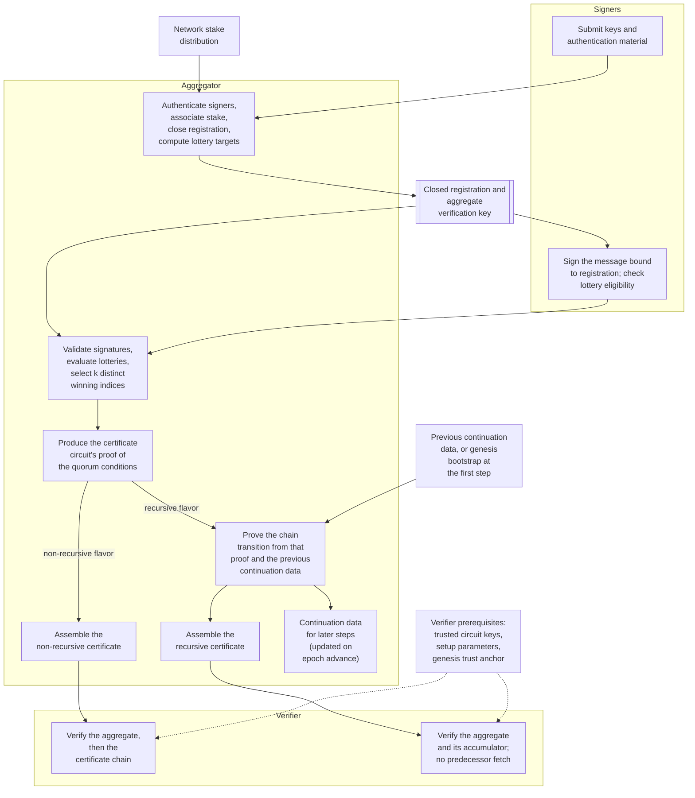

The two flavor branches are alternatives. Under recursive aggregation the certificate-circuit proof is an internal intermediate and is not issued as a separate non-recursive certificate. The arrows are data dependencies, not a claim that each artifact is computed once: the closed registration's commitment is derived independently by the parties that need it. The prerequisites box states what a verifier must already trust, not a check the verifier performs on its own.

Parts 4 and 5 describe what each circuit proves. Part 3 specifies the registration, tree, lottery and message rules the whole sequence rests on.

## The cryptographic building blocks

The SNARK flavors are built from primitives chosen to be cheap to express as circuit [constraints](#proof-system-terms), which is why they differ from the ones the concatenation flavor uses.

| Role | Concatenation | SNARK flavors |
| --- | --- | --- |
| Signer signature scheme | BLS (Boneh-Lynn-Shacham) | Schnorr over the Jubjub curve |
| Default membership-tree hash | Blake2b | Poseidon |
| SNARK backend | Not used | Halo2 with KZG (Kate-Zaverucha-Goldberg) commitments over BLS12-381 |

Schnorr over Jubjub and Poseidon make signature and membership checks efficient to express as constraints. Jubjub's coordinate field is the native field of these circuits, the scalar field of BLS12-381, so its curve arithmetic can be checked without emulation. KZG is the scheme the proof system uses to commit to its polynomials.

Poseidon is the membership-tree hash for the SNARK flavors. Other hashes remain in use elsewhere: the published recursive verification proof uses a Blake2b transcript, continuation proofs use Poseidon, and lottery index selection uses SHA-256. The table is a comparison of these three roles, not an inventory of every hash in the system.

The SNARK backend and circuit gadgets come from four pinned Midnight crates: `midnight-circuits`, `midnight-curves`, `midnight-proofs` and `midnight-zk-stdlib`. Their versions are fixed in [`mithril-stm/Cargo.toml`](https://github.com/IntersectMBO/mithril/blob/main/mithril-stm/Cargo.toml). Mithril defines its own relations and orchestration on top of them. Updating one can change the constraint system and the [circuit verification keys](#proof-system-terms); the [circuit-key update runbook](https://github.com/IntersectMBO/mithril/blob/main/docs/runbook/update-circuit-keys/README.md) covers the procedure and Part 6 the compatibility consequences.

## The module map

The cryptographic core is in `mithril-stm`. The five areas below connect protocol orchestration, signature schemes, membership commitments, proof systems and circuits. Network registration, certificate assembly and client integration involve other crates.

| Module | Contents |
| --- | --- |
| `protocol/` | Registration, participants, single signatures, aggregate signatures, protocol parameters. Shared protocol types and orchestration across flavors. |
| `signature_scheme/` | BLS multi-signatures and Schnorr signatures. |
| `membership_commitment/` | Merkle trees and paths. |
| `proof_system/` | One module per flavor: `concatenation/`, `halo2_snark/`, `halo2_ivc_snark/`. Each holds the prover, the verifier and the flavor's own types. |
| `circuits/` | The circuits themselves: `halo2/` for the certificate circuit, `halo2_ivc/` for the recursive one, plus the trusted setup, key generation, key serialization and the circuit verification key digest. |

`circuits/` and the two SNARK proof-system modules are compiled with `future_snark`. `circuits/` defines the relations, their constraints and the circuit-key machinery. `proof_system/` prepares inputs and drives proving and verification; its runtime setup objects hold the circuit, the setup parameters and the keys obtained through that machinery.

Later parts name the files they discuss.

# Part 3 — Protocol specification, common to both circuits

Part 2 described the pipeline as five steps. This part opens each one, in the same order, under a heading of its own. Both SNARK flavors depend on every rule here. Two steps are specified by the circuits instead of by this part, and the table says where they are.

| Pipeline step | Specified in |
| --- | --- |
| Registration | This part |
| Signing | This part |
| Aggregation, selecting the signatures | This part |
| Aggregation, proving the certificate circuit | Parts 4 and 5 |
| Certificate assembly | This part |
| Verification | Parts 4, 5 and 6 |

## Registration

Registration is where the signer set is fixed. It is specified in two halves: what an individual signer submits while the round is open, and what closing does to the accumulated entries once it ends.

### What a signer submits

Registration fixes a signer set, and that set signs later. A round opened during [epoch](https://mithril.network/doc/next/glossary#epoch) `E` records under the label `E + 1`, and those registrations supply the signer set used at `E + 2`. A signer sends one registration message to the [aggregator](https://mithril.network/doc/next/glossary#mithril-aggregator), which authenticates it and records an entry under the round's label.

| Field | Contents |
| --- | --- |
| `epoch` | The round's recording label, which the submission must match. |
| `party_id` | The signer's pool identity. Certified from the [operational certificate](#protocol-terms); an uncertified value is accepted only in test configurations. |
| `verification_key_for_concatenation` | The BLS verification key with its [proof of possession](#protocol-terms). Serialized as `verification_key`. |
| `verification_key_signature_for_concatenation` | A [KES signature](#protocol-terms) over that key. Serialized as `verification_key_signature`. |
| `operational_certificate` | The stake pool operator's operational certificate. |
| `kes_evolutions` | KES evolutions since the operational certificate's start period. Serialized as `kes_period`. |
| `verification_key_for_snark` | The Schnorr verification key. Optional. |
| `verification_key_signature_for_snark` | A KES signature over the Schnorr verification key. Required whenever that key is present. |

The two SNARK fields are everything the SNARK flavors add to a submission. A signer may omit them both, registering normally and taking part in concatenation aggregation alone. A Schnorr key supplied without its KES signature is rejected on the certified path.

Authentication happens in two layers. The operational certificate and the KES signatures tie each verification key to a [stake pool operator](https://mithril.network/doc/next/glossary#stake-pool-operator-spo), which is what gives `party_id` its meaning. The library then verifies the concatenation key's proof of possession and checks that the Schnorr key is a prime-order point on its curve. Each submission is authenticated on its own, against no other signer's keys.

Stake never travels with the message. The aggregator associates each registered signer with the stake recorded for it in the [stake distribution](https://mithril.network/doc/next/glossary#stake-distribution) used for that registration round, which is what stops a signer from influencing its own [lottery target](#protocol-terms) through what it sends.

**In review: proof of bound possession.** Signers will also submit a proof of bound possession for the Schnorr verification key, binding it to the signer's stake and epoch as well as to its pool operator. At the baseline nothing in the crate implements it and the Schnorr key is authenticated by its KES signature alone; PR #3539 at `559cdfb` adds it. Part 9 gives the construction and what it defends against.

**What this constrains.** Both verification keys travel the same authentication path, so a pool already able to register for concatenation needs no new operator key material to register for SNARK. Because the Schnorr key is optional per signer, one epoch can hold registrations with and without one.

### Closing: the Merkle tree and the aggregate verification key

Closing freezes a registration set and produces the fixed objects that signing and aggregation read. It runs once, over the accumulated entries. Closing the STM set and closing the network's registration round are separate operations.

Entries enter one shared registration set as they are added, and that set rejects an entry whose concatenation verification key, or whose Schnorr verification key when present, is already in it. Two signers cannot share a verification key in one set.

Closing sums the stake of every entry, rejecting both an overflow and a total of zero. It then converts each entry into a closed entry, computing that signer's [lottery target value](#protocol-terms) from its stake, the total stake and [`phi_f`](#notation); the lottery page gives the derivation. Entries are held in a sorted set, so their order follows the entries themselves and not their arrival. A closed entry holds the concatenation verification key and the stake, plus the Schnorr verification key and the lottery target value when the signer registered one.

Each proof system then commits its own leaf form over those entries, in a [Merkle tree](https://mithril.network/doc/next/glossary#merkle-tree) of its own.

| | Concatenation | SNARK |
| --- | --- | --- |
| Leaf contents | Concatenation verification key, stake | Schnorr verification key, lottery target value |
| Leaf width | 104 bytes: 96-byte key, 8-byte big-endian stake | 96 bytes: 64-byte key, 32-byte target value |
| Membership hash | Blake2b | Poseidon |
| Leaf order | By stake, then concatenation verification key | The same sequence, filtered to entries with a Schnorr key |

The concatenation leaf commits the stake; the SNARK leaf commits the target value derived from it. Performing that conversion once at closing keeps the stake arithmetic out of the [circuit](#proof-system-terms), which compares a lottery evaluation against a value it reads from the leaf. Part 4 shows the comparison. The proof therefore rests on the authenticated root for the target's correctness: the circuit does not recompute the target from stake and total stake.

Neither tree sorts by its own leaf contents: the SNARK tree is the registration sequence with the entries carrying no Schnorr key removed. Grouping higher-stake signers together is intended to make selected paths overlap more often, reducing the authentication data a concatenation batch opening needs, that being one membership proof covering several leaves. The SNARK witness carries a separate fixed-length path per signer and does not gain from the grouping.

One tree implementation serves both flavors, parameterized by the hash and the leaf form. It digests each leaf and combines pairs upward, substituting a fixed digest of a single zero byte where a node has no child. The SNARK circuit verifies paths of one fixed length, `MERKLE_TREE_DEPTH_FOR_SNARK`, which is 13, and shorter paths are padded to it. That depth gives the circuit room for 8192 leaves; it is a circuit capacity, not a limit registration enforces.

The [aggregate verification key](#protocol-terms) names the committed set a proof is checked against. Concatenation carries a Merkle tree batch commitment, SNARK a Merkle tree commitment, and both carry the total registered stake, so that a verifier holds the committed set together with the quantity the targets were derived from.

The protocol message carries the next SNARK aggregate verification key in a fixed-width form. The rigid slot, under [certificate assembly](#certificate-assembly) below, specifies that layout.

**What this constrains.** Changing a leaf's byte layout, the leaf ordering or the membership hash generally yields a different commitment for the same signer set, and so a different aggregate verification key. Proofs already issued stay checkable against the commitment and the rules they were made under; what breaks is any path that rebuilds the set and expects the earlier root. Part 6 covers what else moves with such a change.

## Signing

Signing is specified in two halves: the message a signature is taken over, which a fixed-layout preimage determines, and the lottery that decides which of a signer's [`m`](#notation) indices win.

### The message and its preimage

A signer signs two things bound together: the message a [certificate](https://mithril.network/doc/next/glossary#certificate) carries, and the registration set it was produced under.

**The preimage.** In the Lagrange era, a protocol message is laid out in four fixed-width slots, and the era requires a SNARK aggregate verification key to exist. The preimage is each slot's label followed by its value, concatenated in this order.

| Slot label | Width | Value |
| --- | --- | --- |
| `digest` | 32 bytes | Legacy SHA-256 hash of the message's remaining parts, once the three source parts below are removed. |
| `next_aggregate_verification_key` | 44 bytes | The next SNARK [aggregate verification key](#protocol-terms), in its rigid encoding. The rigid slot, under [certificate assembly](#certificate-assembly), gives the layout of those bytes. |
| `next_protocol_parameters` | 32 bytes | The hash of the next protocol parameters, not the parameters themselves. |
| `current_epoch` | 8 bytes | The epoch, read from its decimal value and written little-endian. |

That is 74 bytes of labels and 116 of values: 190 in total, hashed with SHA-256 to produce the 32-byte protocol message hash.

Slot labels are not the names of the message parts that feed them. The aggregate verification key slot is fed by the `NextSnarkAggregateVerificationKey` part; a `NextAggregateVerificationKey` part is a different entry and stays inside `digest`. A producer can check the layout before signing, through `check_rigid_integrity`, which reports a missing part, a value of the wrong width, or an epoch that is not decimal. The hashing helpers themselves substitute zeros instead of failing.

Fixed widths give the recursive [circuit](#proof-system-terms) a preimage of known size with the three transition fields at known offsets, so it reads them from fixed byte ranges. Everything variable is folded into `digest`.

The older scheme, which the earlier Pythagoras era uses throughout, takes SHA-256 over each part's key and then its value, in part-key enumeration order. Its preimage is variable-length. Part 8 covers the era switch.

**What is signed.** The SNARK signing message is a pair of field elements: the closed registration's Merkle tree commitment, then the protocol message hash. The commitment must be exactly 32 bytes and a canonical field element, so a value at or above the field modulus is rejected. The message is 32 bytes, or 64 hex characters decoding to them, read as a little-endian integer and reduced modulo the field.

Pairing the commitment with the message binds a signature to a registration set: the same protocol message under a different closed registration yields a different signed value.

**Domain separation.** Poseidon hash purposes are separated by fixed field-element tags prefixed to their input. The crate defines four such tags, of which three matter here. The aggregator's selection hashes are separated too, but they are SHA-256 over byte-string tags of their own; aggregation covers them.

| Tag | Enters | Does not enter |
| --- | --- | --- |
| Unique signature | The signature's challenge. | The commitment point, or the lottery. |
| Lottery | The lottery prefix, and through it every evaluation. | The signature's challenge. |
| Circuit verification key digest | The digest identifying a configured circuit, covered in Part 6. | Signing or the lottery directly. |

The certificate circuit assigns the signature and lottery tags as fixed values, and a unit test asserts the two differ.

**The signature itself** is a unique Schnorr signature. Besides the randomized challenge and response it carries a commitment point, obtained by applying the signing key to a point derived from the message, and therefore determined by the key and the message alone. The next subsection uses that property.

**What this constrains.** Changing a slot width, a label, or their order changes every rigid protocol message hash, and so every signature made under it. Changing a domain separation tag changes the hashes of that tag's purpose only: the signature challenge, or the lottery evaluations, or the circuit digest. Part 6 covers what moves with a changed digest.

### The lottery and the target value

Each signer holds a [lottery target](#protocol-terms) fixed when registration closed. Signing evaluates [`m`](#notation) lotteries against it, and each win is a [lottery index](#protocol-terms).

**The evaluation.** A prefix is derived once per message, as the Poseidon hash of the lottery domain separation tag together with the signed message. For each index below `m`, the evaluation is the Poseidon hash of that prefix, the two coordinates of the signature's commitment point, and the index. The index wins when its evaluation is at most the target. An index at or above `m` is rejected, and a signer whose indices all lose returns no SNARK signature.

Because the commitment point is determined by the signing key and the message, and is computed before the signature's nonce is sampled, the winning indices are already fixed before the signature exists. For one key and one signing context, re-running signature generation with fresh randomness cannot change them. Part 9 covers what a signer might still influence by other means.

**The target.** A signer of stake fraction [`w`](#notation) should win a given index with a probability set by the protocol parameter [`phi_f`](#notation):

$$q = 1 - (1 - \phi_f)^{w}$$

Outside the near-one shortcut below, the stored target scales that probability across the field:

$$T = \lfloor p \cdot \tilde{q} \rfloor$$

where `p` is the modulus of the Jubjub base field and the tilde marks the value the implementation computes in place of `q`. Treating the evaluation as uniform over the field, an index wins with probability `(T + 1) / p`, the comparison being inclusive. That is near `q` rather than equal to it: the approximation is inexact and `T` is an integer. Part 9 treats the hash model and what the deviation permits.

At `w = 1` the ideal probability is `phi_f` itself.

**Deriving the target.** Every signer and the aggregator must reach the same `T` from the same inputs, so the derivation is built for reproducibility rather than exactness. It runs in three stages.

1. `phi_f` arrives as a floating-point parameter and is approximated by a rational, through `Ratio::approximate_float`. Everything after this point is exact rational arithmetic on that approximation, not on the original value.
2. `ln(1 - phi_f)`, and then the exponential of `w` times that logarithm, are evaluated as fixed-length Taylor series of 30 terms each, the second by binary splitting so the terms combine as exact rationals.
3. The exponential approximation is subtracted from one, multiplied by the modulus, and truncated by Euclidean division. The target is stored as 32 little-endian bytes.

Thirty terms give about 69 bits of precision at `phi_f = 0.2`. That accuracy governs how far a signer's real winning probability sits from the `q` its stake calls for; Part 9 analyses the consequences for fairness and for splitting stake.

Some inputs never reach the series. A total stake of zero is rejected, as is any `phi_f` outside `]0, 1]`. A `phi_f` within one double-precision epsilon of 1, which covers 1 itself and `0.9999999999999999`, returns the largest representable target, so every index wins regardless of stake.

**Bounds.** The [circuit](#proof-system-terms) compares indices with 16-bit [constraints](#proof-system-terms) and requires [`k`](#notation) `< m <= 2^16 - 1`. This is a circuit bound; the host's own lottery loop does not impose it.

**What this constrains.** An implementation deriving targets differently can produce different committed targets, and so a different [aggregate verification key](#protocol-terms) and a different set of winning indices. Implementations must agree on the derivation, including the series lengths and the conversion of `phi_f` to a rational.

## Aggregation

Which signatures enter the proof is specified here. Proving the statement they satisfy belongs to the circuits: Part 4 for the certificate circuit, Part 5 for the recursive one.

The aggregator turns the signatures it received into exactly [`k`](#notation) index-signature pairs, in three stages. Every input to the choice is public and fixed before aggregation starts.

**Validate and recompute.** A single signature always carries a concatenation part, and may also carry a SNARK part when the signer registered a Schnorr key and its SNARK signing attempt succeeded. That SNARK part holds the signer's unique Schnorr signature over the signed message together with a list of winning indices, empty until aggregation fills it in. It holds no proof of any kind; none exists until the aggregator builds one.

A received signature survives only if it has that SNARK part, its signer has a SNARK registration entry, its Schnorr signature verifies against the signed message, and it wins at least one index. The aggregator recomputes the winning indices itself, from [`m`](#notation), the signed message, the signature and the signer's committed target; it does not trust indices a signer supplied. A signature failing any of these is dropped without an error, because the aggregator collects what it can and judges the total afterwards.

**Select `k` indices.** The survivors are grouped by the [lottery indices](#protocol-terms) they win. If fewer than `k` distinct indices appear across all of them, aggregation fails and reports both the count and the requirement. Otherwise a seed is derived from the signed message alone:

`seed = SHA-256("MITHRIL_SNARK_SELECTION_SEED" || commitment || message)`

Both operands are the canonical 32-byte little-endian encodings of the two signed-message field elements, so the second is the message hash after its reduction into the field rather than the digest's original bytes.

Each distinct index is then ranked by `SHA-256("MITHRIL_SNARK_SELECTION_INDEX" || seed || index)`, and the `k` smallest are kept. The ranking is independent of who signed.

**Deduplicate.** Several signers can win the same index. For each selected index the aggregator keeps the signer minimising `SHA-256("MITHRIL_SNARK_SELECTION_DEDUP" || seed || index || signer index)`. Equal hashes break on the lottery index when selecting and on the signer index when deduplicating, so both orderings are total.

Lottery indices and signer positions enter these hashes as 8-byte little-endian integers; the 16-bit bound on an index constrains the [circuit](#proof-system-terms), not these inputs. The result is a map from lottery index to one signature, in increasing index order, holding exactly `k` entries, and the circuit's [witness](#proof-system-terms) is built from it.

**Why ranking rather than arrival order.** The seed comes from the message, the ranks from public indices, the tie-breaks from registration positions. For one message, registration, parameter set and pool of candidates, the order an aggregator works through them changes neither the selected indices nor the winning signer for each. Signature randomness enters no rank, so a signer cannot improve its position by signing again. Part 9 covers influence over the inputs themselves.

**What this constrains.** Concatenation selects on a different rule: at least `k` indices, with a contested index going to the smaller signature value. The SNARK rule fixes the count at exactly `k` because the circuit rejects a witness of any other length. Changing a domain separation tag, a seed input, or the byte order of an index can change which signatures a given set yields, so every aggregator must apply the rule identically.

## Certificate assembly

Assembly puts the [aggregate signature](#protocol-terms) and its [ancillary verifier data](#protocol-terms) into a certificate. Each has a binary encoding, and each travels in a certificate field as hex.

**What a certificate carries.** Four fields hold the material specified here, each a hex string.

| Field | Contents | Encoding |
| --- | --- | --- |
| `multi_signature` | The aggregate signature | JSON-hex for concatenation, binary-hex for both SNARK flavors |
| `aggregate_verification_key` | The concatenation aggregate verification key, on every certificate | JSON-hex |
| `aggregate_verification_key_snark` | The SNARK aggregate verification key, when the epoch has one | Binary-hex |
| `ancillary_verifier_data` | What the flavor's verifier needs, when the flavor needs anything | Binary-hex |

The two verification keys occupy separate fields rather than one field that changes encoding, so a SNARK certificate carries both. Only `multi_signature` varies with the flavor: concatenation stays on JSON there because the binary aggregate signature encoding is readable only by clients from distribution 2617.0 onward, and distributions up to 2603.1 are still supported. A reader tries JSON-hex first and falls back to binary-hex.

**The aggregate signature in binary.** A version byte of 1, followed by a CBOR structure holding a type tag and the inner proof's own bytes.

| Aggregation flavor | Type tag |
| --- | --- |
| Concatenation | 0 |
| Non-recursive SNARK | 1 |
| Recursive SNARK | 2 |

An earlier outer framing, the type tag followed directly by the inner proof bytes, is still read. Decoding dispatches on the first byte: a leading 1 is decoded as CBOR and falls back to the earlier framing if that fails, and any other leading byte goes straight to the earlier framing. The fallback exists because a leading 1 means either the version byte or the non-recursive SNARK type tag, and nothing in the byte distinguishes them.

The earlier framing only strips the outer byte; what is accepted after that is the inner decoder's decision. Concatenation keeps a legacy inner format of its own. Both SNARK inner proofs require versioned CBOR and reject the older fixed-offset encoding, so the outer fallback does not make every historical SNARK proof readable.

**The SNARK aggregate verification key.** It uses the same version byte and CBOR convention, encoding the key structure directly rather than the signature's tagged envelope. Its earlier form is the Merkle commitment bytes followed by the total registered stake as a big-endian `u64`. The first byte is ambiguous here too, for a different reason: a commitment's first byte can be 1 by chance. Its earlier-format decoder therefore reads the commitment bytes directly, rather than passing them back through the commitment's own decoder, which would run version detection a second time on a digest. The concatenation key has a different legacy layout and does not fall back after a failed CBOR decode.

**Ancillary verifier data.** Each flavor emits what its verifier needs.

| Flavor | Ancillary verifier data |
| --- | --- |
| Concatenation | None |
| Non-recursive SNARK | The certificate circuit verification key |
| Recursive SNARK | The certificate and recursive circuit verification keys, and the genesis message hash |

It occupies its own optional certificate field rather than travelling inside the aggregate signature, and verification requires the variant matching the flavor. Its encoding is the version byte followed by CBOR of the variant, with no legacy fallback: bytes without the prefix are rejected. A recursive certificate may separately carry prover continuation data, which is a different field with a different purpose; Part 5 covers it.

**The rigid slot.** The preimage described under [signing](#the-message-and-its-preimage) carries the next SNARK aggregate verification key in 44 fixed bytes: the 32 commitment bytes, four reserved bytes that are always zero, then the total registered stake as a little-endian `u64`. The circuit reads the first 32 bytes to extract the next root, while the whole preimage is hashed.

**What this constrains.** Decoding is not validation. The type tag selects an inner decoder, and a successful decode says nothing about the proof: the inner CBOR structures do not reject unknown fields, so one payload can satisfy more than one of them, and the fallback path can decode bytes that were merely reframed. Validity comes only from verifying the proof against the expected public inputs in a trusted verification context. The fallback also hides the original decoding error, so a malformed payload reports the second failure rather than the first.

The version byte and the three type tags are fixed by deployed clients and keep their meanings. A new aggregation flavor takes an unused tag. A new encoding needs both a way to be told apart from the existing ones and a plan for the readers expected to consume it, since compatibility here depends on the transport codec and the client generation, not on the first byte alone.

Concatenation's JSON transport in `multi_signature` is held in place by the oldest supported distribution rather than by the format, and is intended to move to binary once those distributions are retired. Byte order is fixed within each format: big-endian in the earlier aggregate verification key, little-endian in the rigid slot. Part 6 covers the circuit keys in ancillary verifier data, whose compatibility follows the circuit rather than these formats, and Part 7 the serialization compatibility checks and their limits.

## Verification

A verifier's obligations follow from what each circuit proves and from the keys it must already trust, so they are specified with the circuits. Parts 4 and 5 give the relations and their public inputs; Part 6 gives the circuit keys and what identifies a circuit. Walking the certificate chain, and checking a downloaded artifact against the message a certificate attests, sit outside the relations; Part 8 covers both.

# Part 4 — The non-recursive certificate circuit

Part 3 specified the protocol both circuits share. This part opens the non-recursive certificate circuit: what one proof asserts, and in what order it asserts it.

A certificate proof establishes that `k` distinct lottery indices were won, each by a signer whose registration leaf opens to one Merkle tree commitment, and each carrying a valid signature over one message. It asserts nothing about stake totals, about how many distinct signers contributed, or about any certificate before it. Part 5 covers the circuit that chains certificates together.

The pages follow the circuit from the outside in: what goes in and what comes out, what the host checks before paying for a proof, the sequence of constraints, the two constraints with mechanisms of their own, and what fixes the circuit's shape and bounds its capacity.

## Public inputs and witness

The [circuit](#proof-system-terms)'s [public input](#proof-system-terms) is the pair a signer signed: the closed registration's Merkle tree commitment, then the protocol message hash. Two field elements, and nothing else.

What is absent matters as much. Total stake never appears, because each signer's [lottery target](#protocol-terms) is already committed in its leaf. Neither [`k`](#notation), [`m`](#notation) nor the tree depth appears, because those fix the constraint system rather than travelling with a proof. A verifier therefore needs the message, the commitment, and a trusted circuit verification key.

The [witness](#proof-system-terms) is exactly `k` entries, one per selected [lottery index](#protocol-terms), in strictly increasing index order.

| Entry field | Contents |
| --- | --- |
| Leaf | The signer's Schnorr verification key and its lottery target value: the two halves of its SNARK Merkle leaf. |
| Merkle path | The authentication path opening that leaf to the public commitment, padded to the fixed depth. |
| Unique Schnorr signature | The signature over the signed message, carrying the commitment point the lottery consumes. |
| Lottery index | The index this entry claims. |

One signer appears in several entries when it won several selected indices, its leaf and path repeated in each.

**What this constrains.** The circuit reads `k` entries and rejects any other count, so the witness has no room for a spare or a missing entry.

## What the host checks before proving

Before a proving run the host verifies most of what the circuit will verify again. The duplication is deliberate: a proof over an invalid witness does not fail cheaply, it fails after the expensive part.

For each signature received, the host requires a SNARK part, looks up that signer's SNARK registration entry, verifies the Schnorr signature against the signed message, and recomputes the winning indices from `m`, the message, the signature and the signer's committed target. A signature failing any of these is dropped silently; Part 3 specifies the selection and deduplication that follow.

Witness construction then computes one Merkle path per unique selected signer and copies it into each entry that signer contributes.

Three guards run at the start of synthesis, before any constraint is emitted.

| Guard | Rejects |
| --- | --- |
| Parameters | `k >= m`, or `m` above `2^16 - 1` |
| Witness length | Any length other than `k` |
| Lottery index | An index at or above `m`, or above `2^16 - 1` |

Further checks run as the witness is assigned: path siblings and positions are matched against the configured depth, and a signature's commitment point is reconstructed as a prime-order point, which can fail. Those make synthesis well defined rather than filtering eligibility.

Two protocol checks the host never verifies. It constructs each Merkle path from the tree rather than checking one, and its sorted output makes index order true by construction rather than by test. Both are enforced in-circuit and nowhere earlier.

**What this constrains.** The repeated eligibility checks are a filter, not a security boundary. The circuit re-verifies the signature, the membership and the lottery for every entry it reads, so an invalid signature or a losing index cannot satisfy those constraints whether or not the host looked first. The reason to run them is cost.

## The constraint sequence

The circuit emits its constraints in a single pass. Order matters in two places: the lottery prefix must exist before any entry is checked, and each entry's index must exceed the one before it.

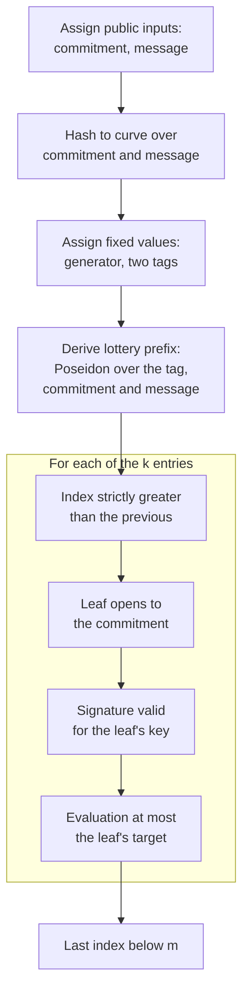

**Setup, once.** Both [public inputs](#proof-system-terms) are assigned. They are hashed to a curve point that every signature check reuses. The Jubjub generator and the signature and lottery domain separation tags are assigned as fixed values, so a proof cannot vary them. The lottery prefix is then derived by Poseidon over the lottery tag and both public inputs, which is what binds every evaluation to this message and this registration set.

**Per entry.** Each of the `k` entries contributes four kinds of check.

| Constraint | What it enforces |
| --- | --- |
| Index order | This entry's index is strictly greater than the previous entry's. Not emitted for the first entry. |
| Membership | The leaf rebuilt from the entry's verification key and lottery target value opens to the public commitment. |
| Signature | The unique Schnorr signature verifies under that verification key, over the hashed message. |
| Lottery | The evaluation derived from the prefix, the signature's commitment point and the index is at most the leaf's target. |

The lottery comparison is written as its negation: the circuit derives the evaluation, then asserts that the target is *not* strictly below it, which is the inclusive test the host performs. Index order and index bounds both reduce to the same 16-bit comparison, one asserting the previous index is below the current, the other asserting an index is below `m`.

**Once more at the end.** The last index is checked against `m`. For a nonempty witness one check suffices for all `k`: the indices strictly increase, so bounding the largest bounds every one. That is also why distinctness needs no set membership check, and why the witness must arrive sorted.

**What this constrains.** Everything a proof asserts is in this sequence, and nothing outside it is asserted. In particular the sequence never reads a signer's stake, never counts distinct signers, and never consults the registration set beyond the one commitment it was given.

## The membership constraint

The [circuit](#proof-system-terms) rebuilds the leaf rather than reading one. It takes the two coordinates of the signer's verification key and the [lottery target value](#protocol-terms) from the entry, and hashes those three values with Poseidon. A signer therefore cannot present a target it was not registered with: the target is an input to the hash that has to open to the public commitment.

From that leaf the circuit walks upward. At each level the position bit decides which of the accumulator and the sibling goes left, and Poseidon combines the pair.

**Padding.** A path is padded to the fixed depth with zeros, so that one circuit serves any tree up to its capacity without being regenerated for each size. From the second level upward, a sibling of zero marks the level as padding and the accumulator passes through unchanged. Without that rule a tree shallower than the fixed depth would keep hashing above its real root and arrive at a value the commitment was never taken from.

**The first level** carries no such check: it is hashed unconditionally, which saves constraints on every entry of every proof. That rests on the real path having at least one level, which holds for every tree of two or more leaves, where an absent sibling is filled with the hash of a single zero byte rather than a zero field element.

**The one-leaf case** falls outside that. A tree of exactly one leaf has no levels at all — its root is the leaf hash and its path is empty — so the circuit would hash that leaf against a padding element and reach a different value. Registration imposes no minimum signer count, so nothing upstream excludes the case.

The walk ends by asserting the computed root equals the public Merkle tree commitment.

**What this constrains.** The padding rule keys on a sibling equal to zero, so a genuine sibling hash of zero would be read as padding and the level skipped. Poseidon makes that negligible rather than impossible, and the circuit does not check it. The rule is what decouples the circuit from tree size within one configuration: at the production depth of 13, trees from two up to 8192 leaves prove against the same key.

## The signature constraint

One equation carries this check. The circuit computes two multi-scalar multiplications over the same pair of scalars, the signature's response and its challenge:

| Result | Points |
| --- | --- |
| `R1` | The curve point hashed from the two public inputs, and the signature's commitment point |
| `R2` | The Jubjub generator, and the signer's verification key |

It then hashes eleven field elements with Poseidon: the signature domain separation tag, then the coordinate pairs of the hashed point, the verification key, the commitment point, `R1` and `R2`. The constraint is that this equals the challenge the [witness](#proof-system-terms) supplied.

`R2` is the ordinary Schnorr verification equation, taken against the generator. `R1` is the same equation taken against the hashed point instead. Satisfying both forces the commitment point to be the signing key applied to that hashed point, rather than a point the signer chose. That is what makes the commitment point deterministic, and so what makes the lottery of Part 3 impossible to grind by re-signing.

The challenge appears twice, as a scalar in the multiplications and as a base-field element in the equality. They are not two independent witness values: the base-field challenge is assigned once and converted in-circuit to its scalar form, and that conversion is itself constrained.

**What this constrains.** The eleven inputs and their order are part of the signature scheme, not an implementation detail: any change to either invalidates every signature ever produced.

## What fixes the constraint system

`CertificateCircuit` holds three values and nothing from any single execution: [`k`](#notation), [`m`](#notation) and the Merkle tree depth. Those three decide the shape of every constraint the circuit emits.

The relation's serialized form is exactly those three values, little-endian. Circuit identity is a separate matter, decided by the verification key digest and not by this triple. Part 6 owns it.

**The architecture** is the second half of what fixes the circuit: which chips of the standard library are enabled. The certificate circuit enables Jubjub, Poseidon and two power-of-two range columns, and nothing else. It is declared in one place and read in three: the relation declares it to the standard library during synthesis, key generation configures a constraint system from it, and the key decoder rejects an encoded key whose declared architecture differs.

That last check is what keeps the position typed. A Midnight verification key carries its own architecture and degree in its bytes, so without it any Midnight circuit's key would decode successfully in the certificate position — including the recursive circuit's, which this crate encodes the same way.

The verification key committed in the crate is generated for `m` 16948, `k` 1944, `phi_f` 0.2 and depth 13.

**What this constrains.** Change `k`, `m` or the depth and the circuit is a different circuit, with a different key and a different digest; Part 6 covers what that costs. Enabling a chip changes the architecture, which invalidates every key encoded under the old one rather than merely growing the circuit.

## Degree and capacity

The degree is [`K`](#notation) in the book's notation: the circuit occupies `2^K` rows of the evaluation domain, and every constraint it emits has to fit in them.

The certificate circuit's degree is not pinned to a constant. It follows from the configuration — `k`, `m` and the depth — and is bounded above by the trusted setup, whose structured reference string supports degree 22. Different configurations legitimately reach different degrees, which is why a key declares its own degree in its bytes rather than matching a constant. The recursive circuit is the opposite case: Part 5 covers its pinned degree.

| Quantity | Bound | Fixed by |
| --- | --- | --- |
| Witness entries | Exactly `k`, 1944 in production | The circuit, which rejects any other count |
| Lottery indices | `m` at most `2^16 - 1` | The 16-bit comparison used for index checks |
| Tree leaves | 8192 | The fixed path length of 13 |
| Degree | At most 22 | The [trusted setup](#proof-system-terms) |

**What this constrains.** The bounds are not alike in what it takes to move them. Depth is a configuration value, so serving more than 8192 signers means generating the circuit at a greater depth and issuing a new key. An `m` above 65535 is not reachable that way at all: it needs the 16-bit comparison and its validation changed, which is an implementation change. Raising `k` raises the row count directly, since each entry contributes its own membership, signature and lottery constraints, so a large enough quorum pushes the degree past what the trusted setup supports.

# Part 5 — The recursive circuit

Part 4 specified the circuit that proves one certificate. This part opens the recursive circuit, which proves a chain of them.

Five of its pages mirror Part 4's, because the two circuits do the same kind of thing there: public inputs and witness, what the host checks, the constraint sequence, what fixes the constraint system, and degree and capacity. Reading each against its counterpart is the quickest way to see what recursion changes. The remaining pages have no counterpart, and they are the ones recursion forces: why it exists, how a step is produced, the transition and accumulation constraints, the rolling state that carries a chain forward, and what a client does with the result.

## Why recursion

Recursion changes what a client does to trust a certificate.

Under concatenation and non-recursive SNARK, a certificate establishes that a quorum signed one message under one registration. Establishing that the registration is the one the chain reached requires following certificate links back to genesis, so a client's work grows with the length of the chain.

The recursive [circuit](#proof-system-terms) consumes two proofs at each step: the certificate proof for the new certificate, and the recursive proof carried in the previous committed rolling state. A proof together with its accumulator covers the ancestry that rolling state represents, so a client checks one proof instead of following links back to genesis.

That ancestry is not a step count. Only some publications commit a new rolling state, so two certificates can share an ancestry without either covering the other. *The rolling state and its encoding* gives the rule.

The size of a step does not depend on how many steps precede it, because the predecessor enters as a fixed-size proof rather than as a history.

Two costs come with that. The circuit does not finish either verification inside itself: the pairing check that completes one is expensive to emulate in this circuit's field, so the circuit prepares both proofs and defers the rest, and a single check at the end discharges what has accumulated. *The accumulation constraint* describes what is deferred and what settles it. Separately, the recursive circuit is built for one specific certificate circuit: its relation embeds that circuit's verifier metadata, so a change reaching that metadata reaches the recursive key. The dependency does not run the other way — a change confined to the recursive circuit leaves the certificate key alone. Part 6 covers key compatibility.

## Producing a step, end to end

A recursive step is produced by two provers in sequence, with the host checking before the first and preparing between them.

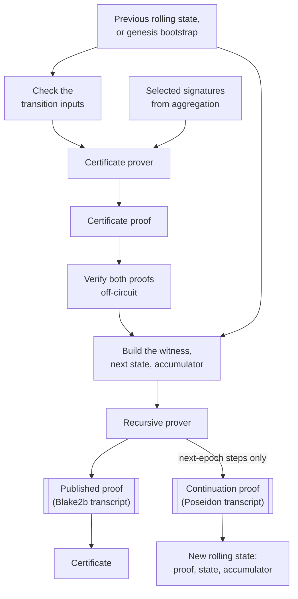

**The transition inputs are checked first**, before either proof is produced. That ordering is deliberate: a rolling state or preimage that cannot yield a valid step is rejected before any proving cost is incurred.

**The certificate proof comes next.** Aggregation selects the signatures and the certificate prover of Part 4 turns them into a proof. Nothing about that step is recursion-specific; the recursive path consumes its output.

**The host then verifies and prepares.** It verifies the certificate proof off-circuit, verifies the previous recursive proof carried in the rolling state, re-validates the transition, and builds the witness, the next state and the folded next accumulator. *What the host checks before proving* covers this.

**The recursive prover runs the circuit, once or twice.** Both runs prove the same statement over the same witness, proving key and public inputs. They differ in the transcript hash used to derive the Fiat-Shamir challenges, because the two outputs have different readers.

| Proof | Transcript | Read by | Produced |
| --- | --- | --- | --- |
| Published | Blake2b | Verifiers outside a circuit | Every step |
| Continuation | Poseidon | The next step's circuit | Next-epoch steps only |

Poseidon costs few constraints to recompute inside a circuit, which is what the continuation proof is for. Blake2b is what the intended outside reader would already have: the Plutus builtin surface exposes Blake2b and no Poseidon, so an on-chain consumer could use the hash the ledger provides instead of implementing one in a contract. The certificate proof uses Poseidon because the recursive circuit has to read it, and it keeps Poseidon when published on its own, so it is not the artefact such a consumer would read. Part 8 gives the implementation status.

**What leaves the step.** The published proof goes into the certificate. On a next-epoch step the continuation proof, the next state and the next accumulator become the new rolling state. A same-epoch step produces no continuation proof and leaves the rolling state untouched.

At the very first step there is no rolling state. The prover runs an internal genesis step to seed one, producing a Poseidon proof only, and then proceeds as above.

**What this constrains.** An ordinary same-epoch publication costs one recursive proving run; an ordinary next-epoch publication costs two; the first certificate additionally triggers the internal genesis run. The two proofs are not interchangeable, and each is tied to its transcript hash at the type level so a typed value cannot be passed to the wrong verification path. That marker is a compile-time guard rather than anything recorded in the proof bytes; it is cryptographic verification that rejects incompatible bytes.

## Public inputs and witness

The circuit's public inputs are three groups, in this order: the global anchor, the next chain state, and the next accumulator.

| Group | Contents |
| --- | --- |
| Global anchor | The genesis message and the genesis verification key, plus the transcript representations of the certificate circuit's and the recursive circuit's verification keys. Constant for the whole chain. |
| Next chain state | Seven values: the step counter, the message, the current and next Merkle tree commitments, the current and next protocol parameter hashes, and the current epoch. |
| Next accumulator | The verification work this step has deferred, carried forward for the final verifier to discharge. |

The previous state and the previous accumulator are witnessed; the next ones are public. A verifier reads the state the chain reached, not the state the step started from. Other witness fields are not private by consequence: the global anchor is witnessed and published, and on an ordinary step the certificate's message and commitment reappear inside the derived state.

**How the values become public.** The circuit ignores the instance argument its relation is handed, and instead constrains each derived value as public at the point of derivation. The prover still supplies an explicit public-input vector when the proof is created, and the verifier reconstructs the same vector, so those constraints are what bind the derived values to it.

The [witness](#proof-system-terms) is one structure holding six parts.

| Part | Contents |
| --- | --- |
| Global anchor | The same four values, assigned from the witness and then constrained as public. |
| Previous state | The seven state values as they stood before this step. |
| Certificate material | The genesis signature, the certificate's message and Merkle tree commitment, and the protocol message preimage. |
| Certificate proof | The non-recursive proof being aggregated, as bytes. |
| Previous recursive proof | The proof carried in the rolling state, as bytes. |
| Previous accumulator | The deferred verification work carried in. |

**What this constrains.** The global anchor is witnessed and then published, so a proof records which keys and which genesis it was made against without establishing that those are the correct ones. A verifier holds the genesis anchor independently, which is why Part 2 places it in a trusted bundle rather than in the certificate.

## What the host checks before proving

A recursive proving run is expensive, so the host validates its inputs first. Most of these checks repeat something the circuit also enforces; one does not.

**The transition inputs.** One checker validates the caller's material before either proof is produced.

| Check | What it rejects |
| --- | --- |
| Genesis data | A missing or structurally invalid genesis verification key, or a bootstrap input that does not parse. Always run, since the genesis key is a public input at every step. |
| Rolling state | A state that cannot be advanced. |
| Preimage | A protocol message preimage that is not exactly the fixed size. |
| Branch | Whichever of the rolling state or the genesis bootstrap applies, checked against the message and the aggregate verification key. |
| Parameter promotion | On a next-epoch transition, a previous state whose announced protocol parameter hash already differs from its current one. |
| Message | A preimage whose hash is not the certificate's message hash. |

The parameter-promotion row is the exception, and what it refuses is the promotion rather than the announcement. A certificate may announce a different parameter hash at an epoch boundary and pass. The state it produces then carries a current hash and a differing announced one, and same-epoch certificates continue on that state, because a same-epoch step never consumes the announced value. The step that is rejected is the next-epoch one after it, which would make the announced value current.

The circuit's next-epoch branch takes the previous state's announced hash as the new current one without requiring the two to have agreed, so it permits that promotion. The rule is held by the host alone, and a step rejected for it is not a step the circuit would have rejected.

**The proofs.** Both are verified off-circuit before the recursive run. The certificate proof's transcript is read, the verifier's dual multi-scalar multiplication is extracted, and that is pairing-checked; the previous recursive proof carried in the rolling state is checked the same way, against the public inputs its own step published. Each value produced is the one the in-circuit gadget derives from the same proof. The certificate circuit's host has no equivalent step, because there the certificate proof is produced rather than consumed.

**The accumulator.** The host folds the rolling accumulator together with the two proofs' deferred work, collapses the result, confirms every fixed base it names is present, and checks it. That folded value is the off-circuit counterpart of what the circuit computes, and the new proof commits to it.

The two proof contributions have each been checked individually at this point, so their fold holds by bilinearity. The check covers the rolling accumulator, which is not otherwise rechecked and may come from persisted storage.

**What this constrains.** The repeated checks are a filter rather than a security boundary: what they catch, the cryptographic checks would catch too, and the host reports it before the proving run instead of after. The shape and representation checks are different in kind, making the witness well formed rather than eligible. The parameter-promotion rule is different again, being enforced nowhere else.

## The constraint sequence

A step is a single pass. It assigns the anchor and the previous state, decides whether this is genesis, checks the transition to a new state, and prepares both proofs into a new accumulator. Three values leave as public inputs.

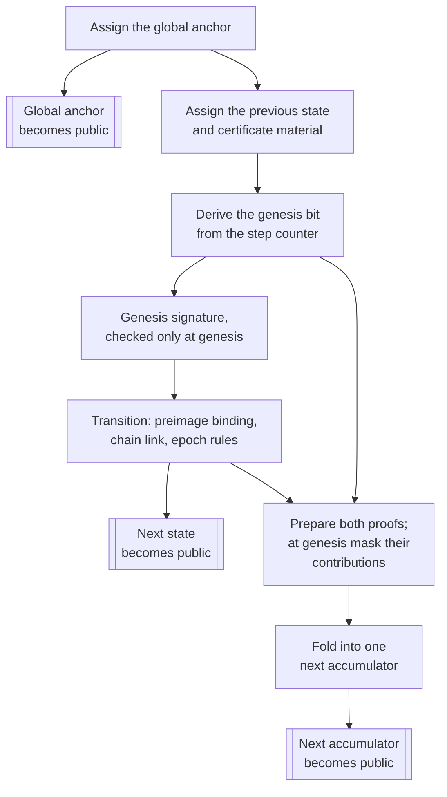

**The genesis bit** is derived from the step counter being zero. It decides whether the genesis signature is enforced, which transition rules apply and which link and consistency requirements are skipped, and whether the two prepared proof obligations contribute or are masked out. At the first step there is no predecessor to verify, so those two contributions are scaled away and the incoming accumulator, which an honest bootstrap supplies as a trivial one, is folded on its own.

**The transition** binds the message to its preimage, reads the next commitment, next parameter hash and epoch from that preimage at fixed offsets, classifies the epoch as same or next, checks the chain link, and selects which values carry forward. *The transition constraint* gives the rules.

**Preparation and folding** complete neither proof's verification. The circuit derives each proof's opening claim and folds it, with the accumulator carried in, into the next one. No pairing is computed at this point; *The accumulation constraint* covers why, and what discharges the obligation.

**What this constrains.** A step enforces the state transition, authenticates the genesis message when it is the genesis step, and establishes that the accumulator it publishes is the correct fold of the obligations the two proofs leave behind. It does not complete either proof's verification, and *The accumulation constraint* covers what that leaves for a final verifier to settle.

## The transition constraint

A step turns the previous chain state into the next one. Which rules apply depends on two questions: whether this is the genesis step, and whether the certificate's epoch equals the current one or follows it.

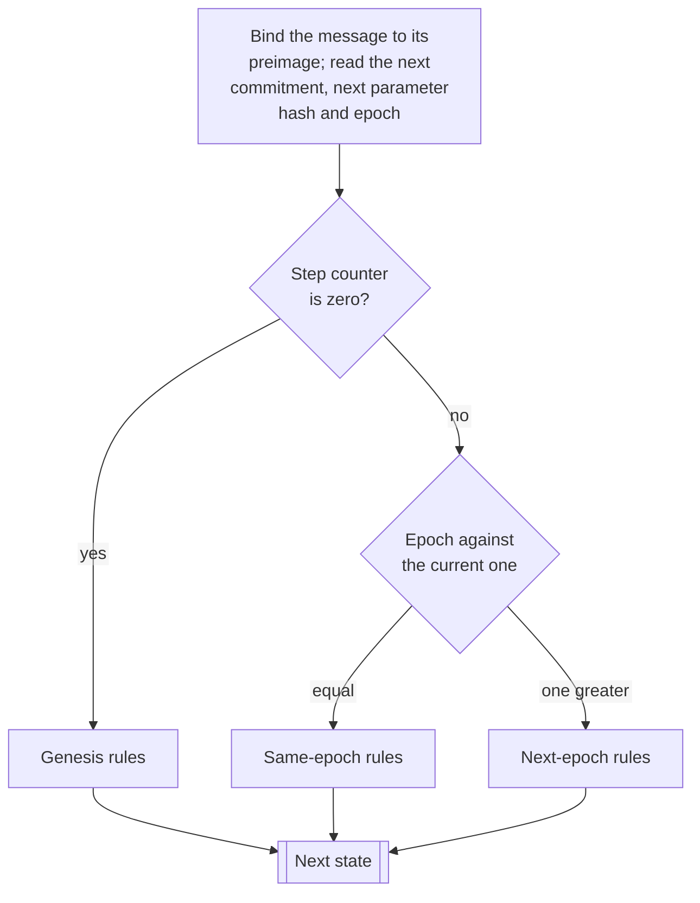

**Bootstrap authentication comes first.** The genesis Schnorr signature over the genesis message is verified in-circuit against the genesis verification key from the global anchor. The result is combined with the genesis bit so that the check is enforced at the genesis step and skipped afterwards: the signature is always computed, never always required.

**The message and its preimage.** The step selects the genesis message at genesis and the certificate's message otherwise, then binds that selection to the protocol message preimage by requiring it to equal the preimage's SHA-256 digest reduced into the circuit's field. The comparison is between field elements, not between 32-byte strings: the circuit combines the digest's bytes into a native field element, and the host reduces the same digest the same way. Genesis does not skip this; it binds to a different message. The next commitment, the next protocol parameter hash and the epoch are then read from fixed byte ranges of that preimage, each reconstructed from its bytes as a field element. Part 3 specifies the layout those offsets depend on.

The state carries parameter *hashes*, not the numeric `k`, `m` and `phi_f`, and those hashes are carried as field elements by the same reduction. The circuit compares hashes, so it can enforce that a value is preserved or promoted without knowing which parameters it stands for. The converse also holds: a hash the circuit accepts reconfigures nothing, because the certificate circuit's numeric parameters are fixed in its key rather than read from the state.

**The step counter** increases by one at every step, and it is the only value that always moves.

**The three rule sets.** Outside genesis, the epoch read from the preimage is classified by comparing it with the state's current epoch: equal makes it a same-epoch step, one greater makes it a next-epoch step. Neither holding is a failure on its own, but the link and consistency checks below then have no branch that can be satisfied. At genesis the comparison does not decide anything, because both of those checks admit the genesis branch directly.

| | Genesis | Same epoch | Next epoch |
| --- | --- | --- | --- |
| Message bound to | The genesis message | The certificate's message | The certificate's message |
| Genesis signature | Enforced | Skipped | Skipped |
| Current commitment | Set to zero | Must equal the previous current | Must equal the previous announced |
| Current parameter hash | Set to zero | The previous current | The previous announced |
| Announced values | Taken from the preimage | Must equal the previous announced | Taken from the preimage |

The next-epoch column is where the chain actually advances: what the previous step announced becomes current, and the certificate announces something new. The same-epoch column is where it stands still, and the announced values are required to repeat rather than change.

**One further rule.** If the previous step counter is one — that is, if this is the first ordinary certificate after the internal genesis step — the epoch must be the next epoch. A chain cannot linger in the genesis epoch.

**What this constrains.** The circuit's next-epoch branch takes the previous announcement as the new current value without requiring the certificate to announce the same thing again, so an announced parameter hash differing from the current one satisfies the circuit at an epoch boundary. The host stops the chain at the following boundary, when that differing hash would be promoted, as *What the host checks before proving* records. Nothing in the circuit stops it at either point, so an implementation relying on the circuit alone would carry a parameter change across an epoch boundary.

## The accumulation constraint

Verifying a proof ends in one expensive operation. The circuit does part of the work that leads to it and records the rest — that final operation, and some of what feeds it — as data. Those records add up across the chain into a single object, and one check at the end settles all of them together.

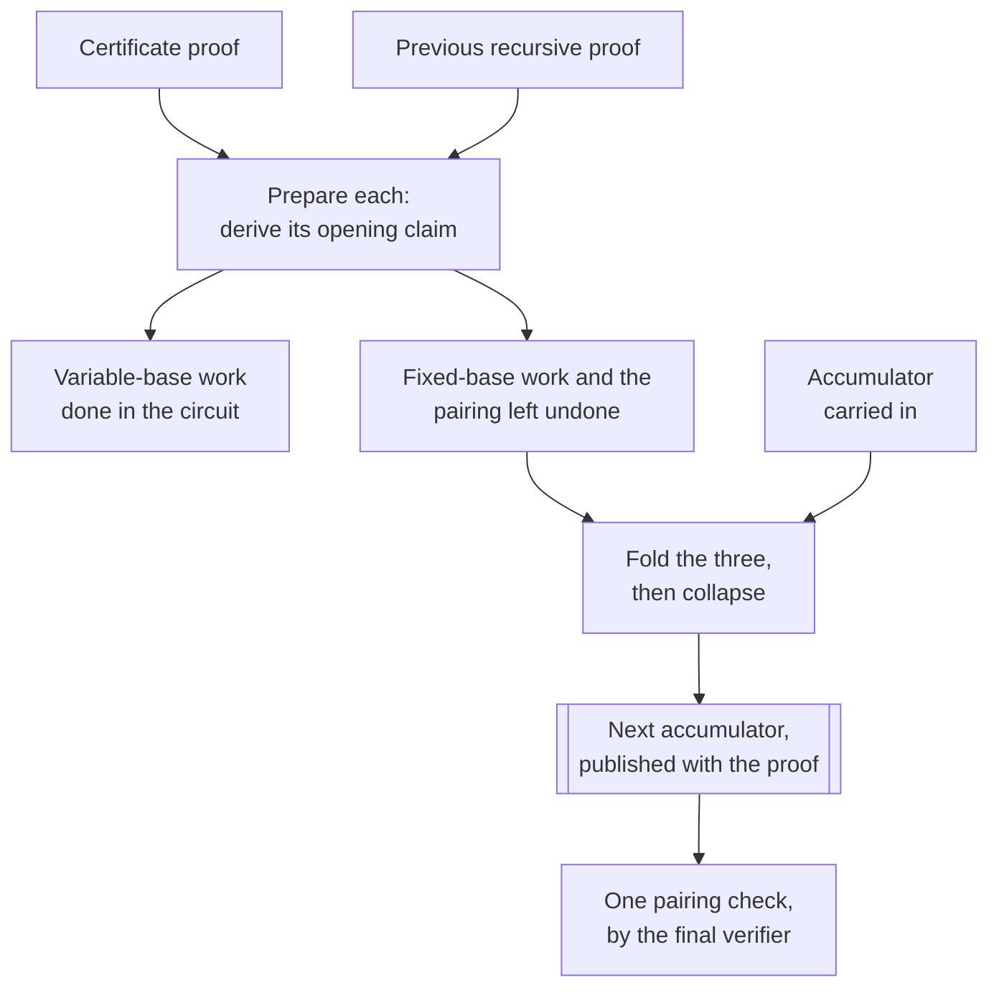

**What is left undone.** Verifying a KZG proof runs in four stages. The relation commitments are recomputed from the verification key's commitments and the proof's evaluations; a map is built for checking that those commitments open correctly; the multi-scalar multiplications are computed; and a pairing check settles them.

The circuit stops part-way through the third stage, and the division is by base rather than by cost alone. Multiplications over variable bases are performed in-circuit. Multiplications over the verification key's fixed bases are not: for those the circuit accumulates scalars and leaves the multiplication outside, along with the pairing.

**An accumulator** is that undone work held as data. It is a pair of multi-scalar multiplications, one for each side of the pairing, each carrying variable bases with their scalars and a set of fixed-base scalars keyed by base name. One accumulator serves both proofs, because keying by name lets two contributions merge into the same structure.

**What makes one valid.** Evaluating the two sides gives two curve points, and the accumulator holds when those points satisfy the pairing equation the proof system's setup defines. That one condition is the whole of what an accumulator asserts, which is what makes deferred work addable: however many obligations have been folded in, the question at the end is still whether a single pair of points satisfies the equation. The proof system's documentation names this the accumulator invariant and states that folding preserves it in both directions, the forward direction unconditionally and the reverse computationally.

**Three operations, not one.** *Preparing* a proof turns it into an opening claim. *Accumulating* combines claims with the accumulator carried in. *Collapsing* rewrites the result into a smaller form. None of the three is a check.

*Preparing* ties each proof to the statement it is supposed to be about. A step prepares the certificate proof against the certificate's commitment and message, and the previous recursive proof against the public inputs that proof's own step published: the global anchor, the previous state and the previous accumulator. That second choice is what carries the earlier state and its obligation into this step's statement.

*Accumulating* is a random linear combination, and the randomness is what prevents cancellation. The three inputs — the accumulator carried in and the claims prepared from the two proofs — are hashed together with Poseidon into a challenge, and the fold is the first plus the challenge times the second plus its square times the third. Because the challenge is derived from all three, an input cannot be chosen to cancel another without predicting that challenge, which the scheme's assumptions make infeasible rather than impossible. Under those assumptions a fold satisfies the invariant only when every input does, so a step that folds in an invalid obligation publishes an accumulator that fails the final check, and no later step repairs it.

*Collapsing* is why the object stops growing. Each side's variable-base part is evaluated down to a single point with scalar one, while the fixed-base scalars stay unevaluated, keyed by name, and merge when two contributions name the same base. Those names come from the two circuits' verifier metadata, so every step draws on the same set and none adds a new entry: a thousand folded steps leave an accumulator the size of one.

**At genesis** there is no previous proof. Both prepared contributions are scaled away by the non-genesis bit and the incoming accumulator is folded on its own. An honest bootstrap supplies a trivial accumulator there — identity points and zero fixed-base scalars, so both sides evaluate to the identity and the invariant holds by construction. The circuit folds whatever incoming accumulator it is given rather than substituting one itself.

**What the circuit establishes** is that the accumulator it publishes is the correct fold of the accumulator it was given and the claims prepared from the two proofs. It does not establish that any of that deferred work passes: both in-circuit verifications can succeed while the folded accumulator fails its check, and the step is invalid in that case.

**What discharges it.** A verifier holds the published proof and its accumulator, derives a challenge from both, and settles them together in one pairing check. That challenge is a second combination, separate from the folds performed inside the chain: it binds the proof to the accumulator at verification time, where the in-chain folds bound each step's inputs to each other. *The verifier contract* gives the client's side of it.

**What this constrains.** A recursive proof and its accumulator have to travel together and be checked together; a proof separated from its accumulator establishes nothing about the chain. What the arrangement buys is the verifier's cost: every deferred check from genesis onward folds into one accumulator, so the work left at the end does not grow with the chain.

## The rolling state and its encoding

The rolling state is what one step hands the next. It holds four values.

| Field | Contents |
| --- | --- |
| Chain state | The seven state values the step published. |
| Continuation proof | The step's Poseidon-transcript proof, as bytes. |
| Accumulator | The folded obligation the step published. |
| Genesis signature | The chain's genesis Schnorr signature, carried unchanged. |

The genesis signature travels in the rolling state because every step witnesses it, not only the genesis step: the circuit computes the signature check at every step and discards the result unless the genesis bit is set.

**When it advances.** Only a next-epoch step produces a new rolling state. A same-epoch step returns none and the aggregator keeps the one it had, which is why two same-epoch certificates built from the same rolling state have the same ancestry and neither covers the other. The first certificate of a chain is a special case: with no rolling state to start from, the prover runs an internal genesis step that produces one.

**The encoding.** The accumulator is the substantial part. It serializes as its left multi-scalar multiplication followed by its right one, and each of those as three length-prefixed sequences.

| Sequence | Encoding |
| --- | --- |
| Bases | A little-endian `u32` count, then each base in Midnight's `RawBytes` format. That is the checked reader: it returns an error on bytes that are not a curve point, and rejects points outside the prime-order subgroup. |
| Scalars | A little-endian `u32` count, then each scalar in raw form. |
| Fixed-base scalars | A little-endian `u32` count, then per entry a little-endian `u32` name length, the name's UTF-8 bytes, and the value in raw form. |

Fixed-base entries are written in the key order of the map that holds them, so the encoding is deterministic: the same accumulator always produces the same bytes.

**What this constrains.** This layout is the persisted form, not the accumulator's public-input representation, and the two are independently specified. Writing in key order is what makes the bytes canonical, and that is what golden vectors pin; reading does not depend on it, since each entry is inserted into a map under its name and the same entries in another order decode to the same accumulator. What a reader cannot absorb is a change to the framing or to how an element is represented — a different count width, a different point format — which needs a reader that understands both or a migration of the stored states.

## The verifier contract

A client verifying a recursive certificate needs three things it already trusts, and takes the rest from the certificate.

| Independent trust requirements | Taken from the certificate |
| --- | --- |
| The genesis verification key, from a trusted bundle | The published proof, its state and its accumulator |
| Authorization of the supplied circuit verification keys | The genesis message hash and circuit keys in ancillary verifier data |
| The verifier parameters for the proof system | |

Receiving a key in ancillary verifier data is not the same as trusting it. Part 6 covers how a circuit key becomes approved; the contract here assumes it already is.

**What the client checks.** It confirms the message it was given matches the message in the proof's state. It reconstructs the public inputs — the global anchor, the state and the accumulator — and prepares the published proof against them, requiring the transcript to be fully consumed. It resolves the accumulator's fixed bases and evaluates both of its multi-scalar multiplications. It then derives a challenge from the prepared proof and the evaluated accumulator, combines the two, and performs one pairing check.

No predecessor certificate is fetched, and no earlier proof is verified. The single check settles the published proof and everything the chain deferred into its accumulator.

**What this constrains.** Verification needs the compact verifier parameters, not the proving key or the full structured reference string, so a client's trusted material is small. The proof and the accumulator must be checked together: either alone establishes nothing about the chain.

## What fixes the constraint system

The recursive circuit holds two things, and neither comes from a single execution: the certificate circuit's verification key, and its own evaluation domain and constraint system.

The certificate key is there because the recursive circuit verifies certificate proofs, and doing so requires that circuit's verifier metadata — its domain and constraint system. That is the direction of the dependency: certificate metadata shapes the recursive relation. A change confined to the recursive circuit does not reach back and change the certificate key.

**The architecture** names the chips the standard library enables. The recursive circuit enables Jubjub and Poseidon as the certificate circuit does, and adds two the certificate circuit has no use for: SHA-256, because the circuit hashes the protocol message preimage, and BLS12-381, because it prepares proofs over the proving curve. It configures four power-of-two range columns rather than two. As on the certificate side, the architecture is declared once and the key decoder rejects a key declaring anything different.

**The self-reference.** The circuit is parameterized by its own verification key, which does not exist before key generation. The cycle is broken by deriving the metadata rather than reading it: given the architecture and the pinned degree, the constraint system is configured and the evaluation domain constructed directly, with no recursive key needed. The key's transcript representation still reaches the circuit, but as part of the global anchor rather than as fixed metadata.

**The backend boundary.** Every field, curve and engine type the recursive circuit builds on derives from Midnight's self-emulation of BLS12-381 proof verification, and the crate confines that dependency to a single module. Part 6 covers what a change to it costs.

**What this constrains.** The recursive circuit cannot be understood or regenerated without the certificate circuit it was built for. Enabling a chip changes the architecture and invalidates every key encoded under the old one.

## Degree and capacity

The recursive circuit's degree is pinned at 19, unlike the certificate circuit's, which varies with its configuration. A supplied verification key is checked against that constant and rejected if it disagrees, so a key generated for a different domain size cannot be used by mistake.

The degree has to be known before the key exists, because the circuit derives its own verifier metadata from the architecture and the degree rather than reading it from a key. A constant is how this implementation supplies that value; a degree fixed in advance by configuration would serve the same purpose.

Four power-of-two range columns are configured rather than one to three. The source records the reason: against production certificate metadata, the smaller counts push the circuit to degree 20, and four keep it within 19. That is an observation about one configuration rather than a general rule.

**What this constrains.** Degree 19 bounds the circuit of one step. It does not bound the ancestry a step represents: the circuit has the same shape whether the state it advances carries one predecessor or a thousand, which is the property recursion exists to provide. Chain length is bounded elsewhere — the step counter is a `u64` and the host rejects an overflow rather than wrapping. Nor is step cost uniform: a same-epoch publication runs the prover once and a next-epoch one twice. Circuit size says nothing on its own about proving time; the recursive benchmark measures it.

# Part 6 — Keys, trusted setup, and circuit identity

This part describes where a circuit verification key comes from, what makes it that circuit's key, and what makes it trusted.

A key passes through five stages, and the sections follow them.

| Stage | The question | Section |
| --- | --- | --- |
| Made | A ceremony produced a public string; a circuit and that string yield a key pair | *Where key material comes from* |
| Named | A digest says which circuit a key belongs to | *Circuit identity and key encoding* |
| Held | A prover gets large material into memory without deriving it again | *Key caching and prover setup* |
| Permitted | A verifier decides whether the key it was handed may be used | *The registry of trusted keys*, *Registry retrieval and enforcement* |
| Replaced | Changing a circuit changes its key | *Key changes and chain continuity* |

The two sides have opposite runtime problems. A prover's material is large — the structured reference string runs to hundreds of megabytes and a proving key is larger — so its question is how not to derive it twice. A verifier's material is small: the KZG verifier parameters are a compile-time constant and the committed verifying keys are a few kilobytes each. Its question is whether the key may be used. Possession and permission are separate, and the middle sections keep them apart.

**The registry sections describe work in progress.** The registry types and checking are on `main`. The tooling and the enforcement are implemented in two open pull requests, and the blocks describing them are marked **In review** with the commit read.

## Where key material comes from

Producing a proof needs public parameters that no single party chose. Mithril takes them from Midnight's [trusted setup](#proof-system-terms) rather than running its own.

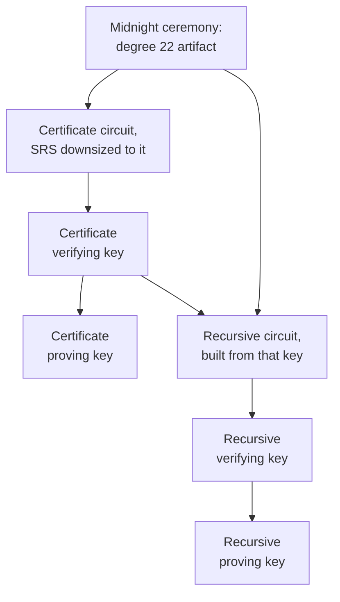

One string serves both circuits. The recursive circuit is the dependent one: it is built from the certificate circuit's verifying key, so its pair can only be derived once that key exists.

**The ceremony and the artifact.** The [structured reference string](#proof-system-terms) comes from Midnight's multiparty ceremony, published with a catalog of derived artifacts. Mithril selects the one supporting degree 22; the ceremony's own output is larger. The trust assumption is the one Part 1 states: at least one participant's randomness stayed secret and was erased.

**Retrieval.** The crate pins the artifact's SHA-256 hash and download URL, and stores it as `srs-parameters` under an `srs` folder. The hash is checked on the download path: an absent file is fetched, hashed against the pinned value and written only if they agree. A file already present is read without being rehashed, so the check covers what arrived over the network rather than what is on disk now.

**Downsizing.** Key generation needs a string at the circuit's own degree. A larger one is downsized on a clone, leaving a caller's string reusable across circuits of different degrees. Reducing one string is safe because its powers-of-tau sequence is a prefix of the larger one's, with the smaller domain's Lagrange basis recomputed from that prefix. Two strings from different ceremonies are not interchangeable for reaching the same degree.

**What is committed.** Two verifying keys ship in the crate as binary assets, one per circuit, generated for the production configuration. Proving keys are not committed; they are derived locally and cached. A proving key is public material rather than a secret.

**What a verifier needs.** Verification does not need the string. The KZG verifier parameters are a compile-time constant and a verifier setup holds no copy of it; the caller supplies the verifying keys, since the certificate key varies with the configuration.

**What this constrains.** A circuit whose degree exceeds 22 cannot be served without selecting a different artifact and updating the pinned hash. The integrity check binds bytes that arrive, not bytes read at each start, so a local file's integrity is the operator's to maintain. Part 7 covers the golden tests that pin the derived keys.

## Circuit identity and key encoding

A verifier is handed a key and has to decide whether it is the key for the circuit it expects.

**The digest.** A circuit verification key digest is a domain-separated Poseidon hash of the key's *transcript representation*, the single field element the proof system derives from a key to seed its transcript. It is 32 bytes, serialized as lowercase hex. It therefore covers the constraint system, the evaluation domain and the commitments rather than the parameter triple. Identical transcript representations give identical digests; identical gates alone do not, because the commitments depend on the string the key was derived from.

**The encoding.** Keys serialize in Midnight's `RawBytes` format, and a key carries its own architecture and degree in those bytes. Checking them is what makes a key position typed: without it, any Midnight circuit's key would decode in the certificate position, including the recursive circuit's, which this crate encodes the same way.

**Three identifiers.** Easy to confuse, and they serve different purposes.

| Identifier | What it is | What it is for |
| --- | --- | --- |
| Serialized key bytes | The key itself, in `RawBytes` | Transport and storage |
| Circuit digest | Poseidon over the transcript representation | Naming a circuit in a registry |
| Cache fingerprint | SHA-256 over a configuration | Choosing a directory on disk |

**Decoding and approval are separate steps.** A key that decodes cleanly and declares the expected architecture is structurally acceptable. Nothing in that establishes that anyone authorized it.

**Where the digests come from.** A certificate carries its circuit keys in [ancillary verifier data](#protocol-terms). The digests checked are computed from those carried keys, in a fixed order: the certificate circuit's, then the recursive circuit's when the flavor has one. They are the keys the proof is verified against, so certifying them certifies the circuits the aggregate signature was produced with.

**What this constrains.** A digest names a verifying key's transcript representation, its encoding included: a dependency release that changes how that representation is built can move the digest while the gates stand still. The other direction is the dependable one — any change reaching the constraint system, the evaluation domain or the commitments produces a new name, which needs its own registry entry. A trusted setup whose material differs moves the commitments and so the digest; selecting a larger compatible artifact from the same setup does not, once reduced to the same degree.

## Key caching and prover setup

Deriving a key pair for a production circuit is expensive, so caching avoids repeating it. Key material is cached at two levels. The recursive benchmark measures disk-cache setup cold against warm, using benchmark fixtures and a locally generated unsafe string; it does not measure production retrieval or a warmed process-wide slot.

**The disk cache.** A key provider holds a directory per circuit configuration, storing the verifying and proving keys as a pair. The production configuration takes an early branch to a stable directory named after the circuit. Every other configuration gets a directory keyed by a fingerprint of itself: a SHA-256 over the cache schema version, the embedded certificate verifying key, the pinned SRS hash, the serialized protocol parameters and the tree depth, with the embedded recursive verifying key's bytes appended for recursive entries.

**What validates an entry.** A cached entry in the production directory is compared against the embedded production verifying key; differing bytes make it a miss, and the pair is regenerated and written over. A fingerprinted entry has no expected key to compare against, because its directory already isolates it. Both kinds still pass through their decoders on the way in.

The schema version distinguishes fingerprinted directories written under different cache layouts. The production directory is not renamed by it and relies on its expected-key comparison instead.

That comparison is between cached bytes and the embedded asset. It does not re-derive the asset from the current circuit, so it detects a stale cache rather than an embedded asset that no longer matches the relation. Part 7 covers the regeneration tests that check the second.

Including the SRS hash in the fingerprint ties an entry to the artifact the crate pins, but it compares a constant rather than the bytes of any local file.

**The process-wide setup.** Above the disk cache sits one setup slot per circuit flavor, keyed by the protocol parameters and the tree depth, holding the loaded string and keys so repeated callers in one process share them. Warming enters the same path: an aggregator starts preparation on its own thread ahead of the first signing round, which waits for it if it has not finished.

**What this constrains.** The cache is a performance mechanism, validating a production entry against a committed asset and a fingerprinted entry without an expected-key comparison. Nothing here decides whether a key may be used. Part 8 covers where the directories live.

## The registry of trusted keys

Trust in a circuit verification key used to be a compile-time matter: a client trusted the key its binary shipped with, and a key later found unsound could not be rejected. The registry replaces that with a published list checked at verification time. Its types and rules are on `main`; the tooling that produces one and the enforcement that consumes it are the next section.

**The document.** A registry is a version and a list of entries, signed as a whole. Each entry is one statement about one digest.

| Field | Contents |
| --- | --- |
| `digest` | The circuit verification key digest the statement is about |
| `name` | A human-readable circuit label, for the audit trail |
| `status` | `allowed` or `revoked` |
| `start_epoch` | First epoch covered, inclusive |
| `end_epoch` | Last epoch covered, inclusive; absent means open-ended |
| `comment` | Free text, typically the reason for a revocation |
| `version` | On the registry rather than the entry: monotonically increasing, for rollback protection |

**The rules.** A digest absent from the registry is rejected, so the list is a whitelist. An allowed entry accepts the epochs its range covers. A revoked entry rejects, and wins where an allowed entry covers the same epoch.

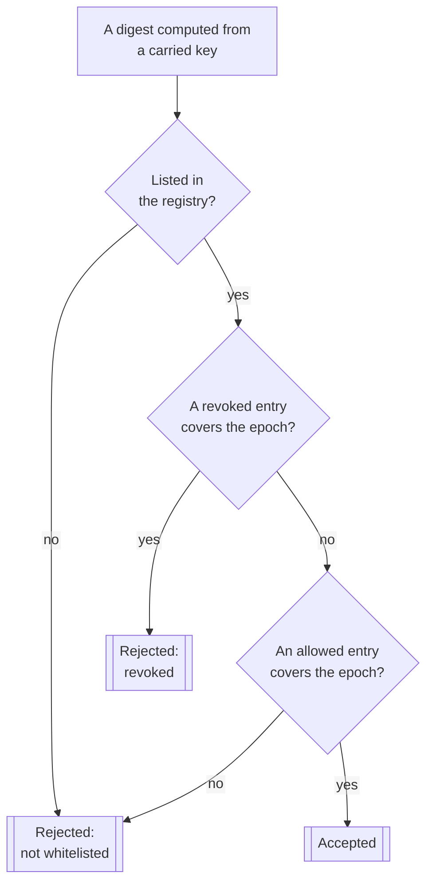

The decision above is the baseline's.

> **In review**, at `c6f2e05` of PR #3541, the rules change. The registry holds **one entry per digest**, and a revoked entry rejects at **every** epoch rather than within its range — the revocation epoch becomes an audit fact rather than a bound, so the middle decision above loses its epoch qualifier. A digest listed more than once is rejected as soon as one of its entries is revoked, so a malformed registry cannot certify a revoked key. What revoking a key does to certificates already produced changes with it; *Key changes and chain continuity* returns to that.

**The signature.** The registry travels as the exact JSON of the registry value, kept verbatim, with an Ed25519 signature over a domain separator followed by exactly those bytes — the nested registry, not the envelope carrying it. Signing the retained bytes rather than a re-serialization lets a verifier tolerate fields a later schema adds: unknown fields survive in the signed bytes and are ignored at parse time. It does not mean older code understands what they express.

The signer is the **Ed25519 half** of the genesis signer, the authority that signs a genesis certificate. It is a different key from the Schnorr key the recursive circuit checks at bootstrap, which Part 5 covers.

**Network scope.** Each network publishes its own registry signed with its own genesis key. The scoping comes from the verifying key a client already trusts, not from any network name inside the document.

**What this constrains.** The registry says which circuits may certify and over which epochs. It says nothing about whether a key is well formed, which decoding establishes, or whether a proof is valid, which verification establishes. A certificate passes all three independently.

## Registry retrieval and enforcement

A signed list is useful only once a node obtains it, checks it and applies it. Retrieval and verification are on `main`; the enforcement paths and tooling are in review.

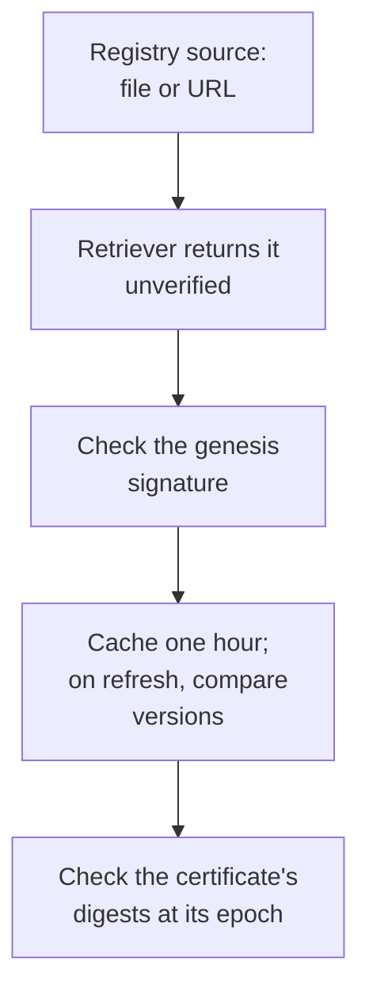

This is the path the in-review stack implements, at #3514 `eaef674`. At the baseline there is no HTTP source and no enforcement step, and every retrieval additionally checks the version against a compiled floor.

**Retrieval.** A retriever returns the signed document unverified, so the transport is not mistaken for the authority: signature and version checks belong to the caller. A file-reading implementation is on `main`; an HTTP downloader arrives with PR #3541.

**Verification and caching.** A certifier verifies the genesis signature over the exact bytes and rejects a registry below a compiled minimum version, a floor bumped at release time when a revocation ships to bound replay of an older, genuinely signed registry. A caching decorator keeps the verified registry for one hour, checked when the registry is used rather than by a background task. A failed refresh fails the check, and a refresh returning a version below the cached one is a rollback error — a check held in one instance's memory, so it does not survive a restart.

> **In review**, at `c6f2e05` of PR #3541, the compiled minimum version is removed and the refresh becomes tolerant rather than fail-closed: a failed refresh keeps serving the registry already verified, with a retry scheduled, and a lower version retains the cached one. A refresh that fails to retrieve or verify can return an overdue error once the registry it retained passes a configured age; a refresh that succeeds with a lower version takes the retention branch instead, which does not consult that age. Availability and revocation latency therefore trade differently from the baseline, and neither path is a general bound on how long a stale registry may be served.

**Where the check runs.** Enforcement is implemented in PR #3514, at `eaef674`, whose base is #3541.

| Flavor | Digests checked | Epoch used |
| --- | --- | --- |
| [Concatenation](#protocol-terms) | None; the registry does not apply | — |
| Non-recursive SNARK | The certificate circuit's | The certificate's own |
| Recursive SNARK | The certificate circuit's, then the recursive circuit's | The certificate's own |

Which flavors require certification is a property of the aggregate signature type, pinned by a golden test: concatenation uses no circuit and is exempt. The check runs in the certificate verifier on both the standard path and the full-chain shortcut. A client resolves its network's registry through the published networks file by matching its aggregator endpoint; an aggregator is configured with a registry URL, where `file://` reads a local file. That routing decides which document is offered, not whether it is trusted: a wrong entry affects availability and which version is seen, while the genesis signature decides acceptance.

**The feature gate.** All of this sits behind the `future_snark` feature, which the distributions do not enable at the revisions described. A network enforces the registry once its distribution is built with the feature, a registry is published for it, and its nodes are configured with a source. Building with the feature is necessary and not sufficient.

**What this constrains.** Signature verification establishes that a registry is authentic, not that it is the latest published. What a node does about updates is the refresh policy and the version rules above; neither establishes that the registry in hand is current. Part 8 covers publication and deployment.

## Key changes and chain continuity

Changing a circuit changes its verifying key, its digest, and therefore its identity to every mechanism in this part. What that costs depends on what the change touches.

| The change | What it requires |
| --- | --- |
| [`k`](#notation), [`m`](#notation) or the Merkle tree depth | A new certificate key and digest, and a recursive setup rebuilt against it. Whether the recursive key itself changes depends on whether the certificate key's domain and constraint system moved, since those are what the recursive relation fixes |
| A change confined to the recursive relation | A new recursive key and digest; the certificate key is unaffected |
| An enabled chip, or a dependency change reaching verifier metadata | New keys for whichever circuits' constraint systems move |
| A different trusted setup | New keys for both circuits, a new pinned artifact hash, and a matching embedded KZG verifier parameter, which verification reads rather than deriving. Selecting a larger artifact from the same setup is a separate case: reduced to the same degree it need not change the derived keys, their digests or the verifier parameter, but it is a different download, so it needs its own pinned hash and source |
| A registry entry expiring or being revoked | No new key; the same key stops being permitted |

**Four separate conditions.** A key may decode and be rejected by the registry. A key may be permitted and produce a proof that fails verification. A proof already made does not stop being valid under the context it was made against merely because a newer circuit exists. And a proof may be valid and permitted while still being unusable as the *predecessor* of a new step. Only the fourth is specific to recursion.

**Why recursion is stricter.** A recursive step's global anchor carries the transcript representations of both verifying keys, and a step prepares the previous proof against the public inputs that proof's own step published, including that anchor. A chain is bound to the certificate and recursive verifying keys it started under. Adding a replacement key to the registry does not convert an existing continuation proof, and the circuit has no key-transition relation letting a chain link to a predecessor made under different keys.

That is the mechanism behind the operational rule: the key-update runbook states that modifying any circuit key is a breaking change requiring a re-genesis of the certificate chain, scheduled by the release manager alongside the release carrying the new circuit. Part 8 covers the procedure.

**What revocation reaches.** Enforcement checks the digests a certificate carries, at that certificate's own epoch. It does not walk the epochs a recursive certificate's ancestry covers, and the recursive circuit does not evaluate registry decisions inside itself. Under range-based revocation, rejecting a key for an earlier range does not by itself reject a later certificate whose ancestry passes through it; under the in-review all-epoch revocation, every certificate carrying that digest is rejected. Neither reaches inside a proof to repair a compromised history, which is why revocation and re-genesis answer different questions.

**What this constrains.** The registry can stop a key being used from now on. It cannot make an existing chain continue under a different key, and it cannot alter what a proof already attests. Part 9 analyses what an adversary gains in the window before a revocation is published and seen.

# Part 7 — Testing strategy

This part describes what the SNARK tests check, what they cost, and the choices that keep them runnable.

Each module has a **principal check**: the mechanism that decides whether behaviour is accepted, with cheaper layers arranged around it. The first three sections take them in turn, each stating what a check demonstrates and the configuration it demonstrates it for.

| Module | Principal checks | What surrounds them |
| --- | --- | --- |
| Certificate circuit | Real proving and verification over the assembled relation; typed validation during synthesis and at setup | A focused test per gadget, through a harness of its own |
| Recursive circuit | `MockProver` at the recursive degree; verification of committed proof assets | Four layers of its own |
| Certificate proof system | The real prover; a committed proof reused by the negative cases | Pure logic, codecs and fixed vectors among the ordinary tests |
| Recursive proof system | The real recursive prover; committed assets | Behaviour tests for wiring; property tests for pure helpers |

These checks are regression evidence. `MockProver` decides whether an assignment satisfies the constraints the circuit implements, not whether those constraints express the intended protocol. A proving test exercises generation and verification for the inputs it is given. Neither establishes that no accepting proof exists for a false statement; Part 9 covers what the security argument rests on.

## What the certificate circuit tests establish

Two levels, and the division gives the coverage its shape. Both use real setup, proving and verification, through harnesses of their own.

**Focused tests exercise one gadget at a time.** The Merkle path gadget accepts a valid entry, rejects a wrong commitment, and accepts a padded path. A further case supplies both a corrupted padded sibling and a wrong commitment, so its rejection does not isolate the padding rule. The lottery gadget accepts a maximal target and rejects a zero target for a fixed fixture, which are the extremes rather than the equality boundary. Its index constraints accept a strictly increasing sequence below `m` and reject an index at the bound. The signature gadget accepts a valid entry and rejects a wrong challenge. The comparison gadget accepts strictly increasing values and rejects equal ones.

**The assembled relation is checked against selected mutations**, and the outcome they assert differs.

| What is mutated | Cases | Rejected by |
| --- | --- | --- |
| The public message or the tree commitment | 2 | The verifier, after proving |
| A path sibling or a position bit | 2 | The verifier, after proving |
| The path length, short or long | 2 | Typed validation during synthesis; no proof produced |
| The leaf: swapped, mismatched, or built from the wrong key | 3 | The verifier, after proving |
| The signature: other message, wrong key, bad challenge, response or commitment point | 5 | The verifier, after proving |
| The lottery target, set below the evaluation | 1 | The verifier, after proving |
| Index order, a repeated index | 1 | The verifier, after proving |
| Index bounds and comparison range | 2 | Typed validation during synthesis; no proof produced |
| Witness length, short or long | 2 | Typed validation during synthesis; no proof produced |
| A duplicated witness entry | 1 | The verifier, after proving |
| Parameters: `k` not below `m`; `m` above the lottery bit bound | 2 | Typed validation, at setup |

Fifteen require the verifier to reject a proof that was successfully generated. Six abort the proving attempt with a typed validation error during synthesis, and two reject the parameters at setup. The distinction matters to an auditor: those eight show the host refused the input, not that the relation's constraints would have rejected it.

Some mutations touch more than one obligation. A leaf swapped while keeping its path changes what the signature is checked against as well as what the membership proof opens to, and the duplicated entry also duplicates a lottery index. Their rejection does not isolate a single named constraint.

The positive cases cover boundaries rather than one path: a message of zero and a message at the field maximum, indices from zero and at the maximum, and Merkle paths that are all-left and all-right.

**The configuration.** Most assembled-relation cases run with `k = 3`, `m = 30`, a depth-12 tree over three thousand signers, and a deterministic unsafe string at degree 13. The parameter cases vary those inputs. Two larger positive cases, at degree 16 and degree 21, are marked ignored and run manually. The certificate key golden is a separate check at `k = 1`, `m = 10`, depth 3, comparing a freshly derived key with committed bytes when it is selected.

None of this exercises production parameters. The production key integrity tests recompute a production key and compare it with the committed asset, and they are ignored, so they run when someone asks for them. They establish that the committed key still matches its derivation; they do not run the mutation cases at production scale.

## What the recursive circuit tests establish

Its tests name their own layers. Each demonstrates something different, and the inference each supports is narrower than the directory name suggests.

| Layer | Demonstrated | Scope |
| --- | --- | --- |
| A, `encoding/` | Representation and layout rules; selected witness-preimage byte mutations synthesized with `MockProver` and checked by their failure rows | Selected byte windows and the message binding, not every constraint that consumes them |
| B, `transitions/` | Stored transition proofs verify; the current circuit accepts expected fixtures; changed public state rows are rejected | Public-row mutation does not independently isolate the chain-link rules |
| C1, `in_circuit/` | Stored-proof and public-input checks, genesis gating, and binding of the accumulator the circuit publishes | A tampered previous proof is rejected off-circuit, either during preparation or by the final pairing check, so this case does not exercise in-circuit rejection; there is no malformed-certificate negative inside the circuit |
| C2, `off_circuit/` | Host accumulator construction, folding, collapse, fixed-base resolution, combined proof and accumulator checks, typed validation | Host behaviour alone; agreement with the in-circuit computation is a separate check |

C2 exists because the recursive circuit defers work. The accumulator is prepared by the host, folded inside the circuit and discharged by a final verifier, so three computations must agree. One case demonstrates that agreement directly: it builds a fresh certificate proof, computes the expected accumulator on the host, checks the circuit accepts it, then changes the accumulator's public rows and checks rejection. A separate replay check compares a stored next state and folded accumulator with recomputed ones.

Verifying a certificate proof on its own completes its opening check with nothing carried forward, so the certificate circuit has no equivalent layer — though Part 5 describes how a certificate proof's obligations are deferred once it is prepared as an input to recursion.

**What positive cases support.** They show the circuit accepts the expected result for the fixtures given. They do not show that result is the only one the constraints admit: a relation missing a necessary constraint would still accept its fixture. The failure-signature helper the negative cases use carries the same limit, and records it — a set of failing rows does not by itself establish which field each row means.

## What the proof-system tests establish

Three kinds of compatibility check, each protecting a different boundary.

**Fixed vectors.** The aggregate verification key's CBOR and rigid-slot encodings are compared with literal byte vectors, so a change to either fails here. Its JSON golden is weaker: it checks that a committed representation is still readable and that the decoded value and the expected value serialize identically under the current serializer. It does not pin the literal JSON output, so a serializer change affecting both equally would pass.

**Round trips.** A proof and the ancillary verifier data are encoded, decoded and re-encoded, and the two encodings compared. This catches an encoder or decoder that has drifted from the other; a coordinated change to both would pass.

**Decoding committed artifacts.** The committed proof and assets are read back and used, which establishes that current code can still consume what was written earlier.

**Rejection against the wrong context.** The committed proof is offered for verification with a wrong message, a wrong circuit verification key, and random or wrong-length bytes. The prepare-and-check entry point has wrong-message and random-byte negatives, and a pairing check on a valid result. The two entry points share cases without having identical negative matrices, and none of this costs proving, because the proof already exists.

**Eligibility vectors.** Target values derived from stake are pinned against committed vectors under `phi_f = 0.2` at a total stake of 45,000,000,000, covering stakes of zero, one and two, values near the total, and three sampled ranges. A further case requires two nearby stakes to produce different targets, which is a separation assertion rather than a computation that must fail.

**Fresh proving** is kept for what needs a new proof. On the certificate side: that the prover produces a verifying proof, that it does so at a different Merkle path length, that proofs made under different parameters do not cross-verify, and that non-deterministic proofs still verify, along with the refusals for an empty or insufficient signature set. On the recursive side: a bootstrap and a same-epoch step, each verifying the proof produced and asserting whether a new rolling state is returned. Further recursive tests cover wiring, verification against committed proofs, codecs and pure helpers.

**Property tests** pin invariants over generated inputs where behaviour is pure: transition classification, state construction, byte-range codecs, public-input ordering and length, and serde round-trips.

**Above the crate**, a node runs against a Cardano devnet in four configured modes: a minimal run for each of the three aggregate signature types, and a full run for concatenation. The SNARK modes run under the Lagrange era with a longer epoch. Part 8 owns what eras and feature switches mean operationally.

## What a test costs

Tests fall into four cost classes, and the gap between the cheapest and the dearest is several orders of magnitude. These classes describe work performed; they are separate from the fast and slow execution categories of the next section but one.

| Class | What it runs | Cost |
| --- | --- | --- |
| Pure | Functions, no circuit | milliseconds |
| Verify-on-asset | The KZG verifier against committed proofs, using embedded verifier parameters | milliseconds to seconds |
| Synthesis | `MockProver` at the recursive degree, keys loaded from assets | a minute or two |
| Proving | String generation, key derivation and real proving | minutes |

The distribution is the reason the rest of this part exists. In the nightly run of 2026-09-23, the `mithril-stm` unit-test binary accounted for 4,272.7 seconds of summed test time across 706 cases; its two integration binaries add four more. The 58 tests in `slow` modules took 4,082.9 seconds of that, or 95.6 percent; the remaining 648 took 189.8 seconds between them. Half the slow time sat in seven tests, the longest of them 761 seconds.

These figures sum each test's elapsed duration, including its setup and any waiting. Tests overlap, so the sum exceeds the run's wall clock: the whole leg's nextest run took 1,892.8 seconds, about 32 minutes across every package it covers, and the job 50 minutes 10 seconds including its builds. Within that run, four recursive proof-system slow tests were limited to one at a time and took 1,391.5 seconds between them; the other 54 slow tests, totalling 2,691.4 seconds, were not serialized.

**Where that time goes** was profiled separately. A local profile on 10 July 2026, at commit `8f2704fe1` under the optimized test profile with cold caches, on a sixteen-core machine, measured one recursive proving path at test scale — quorum 2, three thousand signers, a degree-20 string reduced to degree 19. It found string generation at 42.6 seconds, reduction to the circuit's degree at 135.1, recursive key derivation at 62.0, and each proof at 116.9 to 120.0, with a peak of 10.0 GiB resident. Input preparation, accumulator folding and circuit assembly came to under two seconds together.

Two conclusions from that profile shaped the design, and both are historical measurements of the recursive test setup. Reducing a string cost three times generating one, because it recomputes the entire Lagrange basis — which is why the current setup derives the string at the degree it needs instead. And the cost that remains after setup is proof generation, so the levers are how many proofs are produced and how much setup is repeated, not the arithmetic around them.

The same analysis extrapolated CI cost rather than measuring it, cross-checked against a nightly run: compute-bound work at small degrees about three to four times slower than local, bandwidth-bound work at degrees 19 and 20 only 1.4 to 1.6 times slower, because extra cores stall on memory. Under that estimate a larger runner buys little on the recursive path.

**The process model decides what sharing is possible.** Nextest runs each test in its own process, so a static cannot share setup across tests; the filesystem cache provides that sharing. Reuse within a single process still helps where one test performs an operation repeatedly.

## How the cost is contained

**Setup material is derived once and read thereafter.** The string and keys are written into a cache directory addressed by a fingerprint of what determines their contents, and read back when that directory is populated. The recursive test setup asks for the string at the recursive degree directly, so the expensive reduction is not on the ordinary path at all; the test that exists to exercise oversized setup still performs it. The three-thousand-signer fixture is cached the same way, and its reader validates the decoded fixture rather than trusting the file's presence.

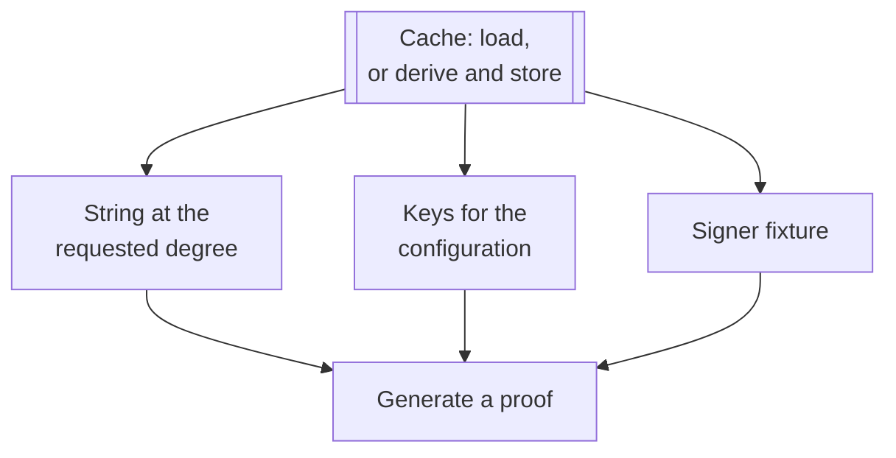

Proving is not cached, because it is what the expensive tests run. Writers and drift guards freshly derive the key or fixture whose generation they check, since a cache hit shows only that an entry exists, not that the current generator would reproduce it.

**Committed proofs replace proving where a test only needs a proof to work on.** A negative case that tampers with bytes takes the committed proof. Fresh proving is retained for prover behaviour and for selected integration checks — the accumulator agreement case generates a certificate of its own, and is the third-longest test in the nightly at 302 seconds.

That division has a limit worth naming: a test verifying a committed proof exercises the verifier against an artifact, not the prover that made it. A prover that had stopped producing any proof would leave those tests passing. The fresh-proving tests are what cover that, when they are selected.

**Synthesis is shared across mutations.** Rather than synthesizing once per tampered field, the public-input binding tests change several rows in one statement, run `MockProver` once, and compare the complete set of failing rows against the expected set. That removes repeated synthesis. It also means each mutation has no independent result, and the row set alone does not establish which field each row carries — the helper records this. Separate witness-mutation cases and positive fixtures supply different evidence.

**Orchestration is tested with doubles.** Input assembly, error mapping and rolling-state threading run against a stub prover. This does not substitute for the circuit checks: doubles replace prover executions only where the subject is wiring.

The test caches are not persisted between CI runs, so a nightly or a slow leg derives its material from cold. Dependency and build artifacts do persist.

## What runs, and when

Three independent controls decide what a run executes.

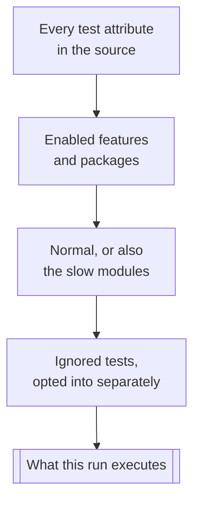

**Features** decide what is compiled: the SNARK code sits behind a feature flag, so a default run contains none of it.

**There are two execution categories.** A test belongs in a `slow` submodule when it consistently exceeds thirty seconds on CI; a developer may also classify one that exceeds fifteen seconds locally. Moving a test back when it becomes cheaper is a maintenance decision; a change in duration does not trigger it.

**Selection** works by exclusion. The base filter drops every `slow` module by a glob, whether or not the script lists it. Modules are added back when a changed source path matches one of their mappings, and the mappings are not one per circuit: a change under the crate's source root selects several, so a run triggered by a recursive-circuit change also carries the protocol aggregate-signature slow tests. All ordinary tests remain selected throughout.

Three things reach the whole slow suite: the `run-slow-tests` pull request label, the nightly run, and any invocation asking for everything. A `slow` module with no mapping is not invisible; it can only be reached by one of those, never by relevance.

**Ignored tests are a separate opt-in** that the slow filter does not grant, and most are not tests in the usual sense. The largest group are **asset generators**, whose job is to write the committed fixtures the rest of the suite reads. Alongside them sit the two production key integrity checks, and a few cases needing network access or a manual run. Integrity checks and writers are different operations: a check reports that derivation and committed bytes disagree, while a writer replaces the bytes, which records a change rather than validating it.

**Two resource controls.** The SNARK leg defaults to the ordinary build profile and switches to an optimized one when slow tests are in scope, so a pull request filtering them out does not pay the build cost. That profile optimizes the dependencies and `mithril-stm`; the configuration records mock-prover synthesis improving 5.6 times and recursive key derivation about 2.2 times once the crate was included, against about 1.5 times from dependencies alone.

The recursive proof-system slow tests run in a group capped at one thread. The configuration gives memory contention on CI runners as the reason, and the July profile's 10.0 GiB peak against a sixteen-gigabyte runner is consistent with it. Those four tests execute one at a time, so their measured durations add to the run's elapsed-time floor however many cores the runner has.

## Benchmarking

Benchmarks measure time and size. Some assert that a proving or verification step succeeded, but those assertions do not replace the regression suite. Seven targets exist.

| Target | Measures | Features required |
| --- | --- | --- |
| `multi_sig` | BLS signing, verification, batch operations | `benchmark-internals` |
| `schnorr_sig` | Schnorr operations and Poseidon hashing | `future_snark`, `benchmark-internals` |
| `halo2_snark` | Certificate setup, prove and verify across parameter tiers | both |
| `halo2_prover_modes` | Mock against real prover, with extrapolated end-to-end totals | both |
| `halo2_ivc_snark` | Recursive prove, verify and fold; proof size; cold and warm setup | both |
| `stm` | Registration, lotteries, concatenation aggregation, batch verification | none declared |
| `size_benches` | Serialized concatenation aggregate sizes | none declared |

**The methods differ**, and a reader comparing numbers across targets needs to know how. `halo2_snark` combines Criterion sampling with single-run tiers. `halo2_ivc_snark` takes manual single observations. `halo2_prover_modes` extrapolates a total from an assumed certificate count, which is a projection rather than a measured run. "None declared" describes the target's own gate, not a promise that optional features never reach the code.

Criterion can reuse setup across benchmark cases in one process; nextest cannot share process-local setup across separate test processes.

The benchmarks' own [README](https://github.com/IntersectMBO/mithril/blob/main/mithril-stm/benches/README.md) holds the invocations, the selection syntax and the resource requirements, including which tiers need a server and which filters avoid starting one by accident. The dated measurements this book retains are there to explain the testing strategy and the security analysis. For a performance number at another revision or configuration, run the benchmarks: a number is comparable only alongside the revision, circuit parameters, machine, build profile and cache state it was taken under.

# Part 8 — Rollout, compatibility, and operations

This part covers what a live network needs in order to produce and verify SNARK certificates, and what changes once it does.

Where a mechanism is implemented in an open pull request and not at the baseline, the text says so and names the revision, using the **In review** marker Part 0 defines.

## Era activation and aggregation selection

Three separate controls decide whether a certificate is a SNARK certificate.

| Control | Scope | What it decides |
| --- | --- | --- |
| The era marker | The network | Which protocol rules are in force, including whether a protocol message is rigid |
| The aggregation flavor | The aggregator | Whether it produces concatenation, non-recursive SNARK or recursive SNARK certificates |
| The compiled feature | The binary | Whether the SNARK code is present at all |

**The era marker** is published on the Cardano chain, signed, and read by nodes from a configured address using a configured era-marker verification key — an authority separate from the genesis key and from the key that signs the circuit key registry. A node applies the latest marker whose activation epoch the network has reached, so a switch can be scheduled ahead of time. The Mithril website describes the [mechanism](https://mithril.network/doc/dev-blog/2023/03/02/era-switch-feature) and the [switch to Pythagoras](https://mithril.network/doc/dev-blog/2024/12/17/era-switch-pythagoras). Two eras exist: Pythagoras and Lagrange. Lagrange is the era in which a protocol message takes the rigid four-slot form Part 3 specifies.

**The aggregation flavor** is the aggregator's own configuration, and it defaults to concatenation. Lagrange does not select a SNARK flavor; it makes one possible. A network can be in Lagrange with every aggregator still producing concatenation certificates.

**The compiled feature** is `future_snark`, which gates the SNARK code at build time. It exists while that code is under development and is expected to be removed once it ships on the default path, leaving the other two controls to decide. Until then, a binary built without it cannot produce or verify a SNARK certificate whatever the era says. Because the trusted setup is downloaded, the feature also requires exactly one TLS backend alongside it, `rustls` or `native-tls`.

Within a binary that carries the flavor, the certificate's own signature variant selects the verification path. A producer's current aggregation setting is not consulted when one of its earlier certificates is verified, so changing that setting does not affect what it has already issued.

Switching to Lagrange is not a message-format change alone. With the feature compiled in, Lagrange message construction requires a next SNARK aggregate verification key and fails when none was computed, whatever flavor the aggregator is set to, and the epoch-settings response stops stripping the signers' SNARK fields. A deployment staying on concatenation across the switch still needs that registration data in place.

## Genesis and node preparation

**One genesis certificate, two signatures.** A Lagrange genesis certificate is signed twice over the same genesis protocol message, with two independent key pairs held together in the genesis bundle: Ed25519 and Schnorr. An ordinary chain walk that reaches genesis checks the Ed25519 signature. The recursive circuit checks the Schnorr signature instead, in-circuit, at its genesis step.

That is why the two SNARK flavors differ in what they need. A non-recursive SNARK proves STM validity for its message, and the chain behind it is established the ordinary way by verifying predecessors, ending at that Ed25519 check. A recursive proof establishes the chain relation back to genesis itself, so it fetches no predecessor and never reaches the genesis certificate; the Schnorr signature is the anchor it checks in its place. Under the in-review enforcement, a node verifying recursive certificates also uses Ed25519, to authenticate the circuit key registry that key signs.

The prerequisites divide by who is responsible for them.

| Who | What they need |
| --- | --- |
| The operator | A genesis signing bundle with both halves, and a signed genesis certificate for the era |
| A node verifying concatenation or non-recursive SNARK certificates | The Ed25519 genesis verification key |
| A node verifying recursive certificates | Both genesis verification halves |
| Provers only | The trusted setup, the derived proving keys, and somewhere to cache them |

A node needs the material for every path it can reach, not the flavor it starts from: a chain walk that begins at a concatenation certificate can meet a recursive one, and that branch fails without the Schnorr half.

Circuit verification keys are not a separate installation: a SNARK certificate carries the keys its proof is verified against in its ancillary verifier data. **In review** at `eaef674`, the verifier checks the digests of those supplied keys against the signed registry it retrieves; at the baseline it performs no such check.

**Supplying a missing half.** A network that predates SNARK has only the Ed25519 half: the signer carries a Schnorr key optionally, and it is absent when an operator loaded a legacy single-key file. Lagrange signing needs both. Preparing a dual genesis separates the key upgrade from the certificate ceremony.

**Upgrading the key bundle** reads the legacy secret, generates a fresh Schnorr keypair, and writes a dual signing bundle and a matching verification bundle. The Ed25519 half is preserved, so the network's existing genesis authority is unchanged. The operation refuses to overwrite existing files. It produces no certificate.

**The genesis ceremony** is separate. The payload is exported, signed offline, and imported, and the import verifies both signatures before the certificate is stored. Nodes that will verify recursive certificates need the new verification bundle: upgrading a secret-key file does not give a distributed legacy verification key a Schnorr half.

**Runtime material.** A prover keeps its material under the system temporary directory, in a `mithril-circuit` root. The trusted setup is a single shared download at `srs/srs-parameters`; the derived verifying and proving keys sit beside it, in a directory per circuit and configuration. Losing the keys costs the time to derive them again; losing the setup costs a re-download, so recovery there also needs the ceremony source reachable and the storage writable. Part 6 covers how a cached entry is validated, and Part 7 covers the separate cache the tests use.

An aggregator configured for a SNARK flavor starts preparing its prover on a background thread at startup. This is preparation and not a readiness gate — the first signing round waits if it has not finished, and a failure is logged rather than fatal. Concatenation prepares nothing.

**What verification needs.** No secret key, no proving key and no SRS download: the embedded KZG verifier parameters, the certificate with its proof and public context, the genesis material its flavor requires, and, under enforcement, a registry it can retrieve. The proving side's cost falls on aggregators.

## Certificate-chain continuity

The ordinary predecessor check compares aggregate verification keys: within an epoch, the two certificates' current keys; across a boundary, the predecessor's announcement for the new epoch against the successor's current key. Which keys it reads depends on the flavor of the certificate under verification.

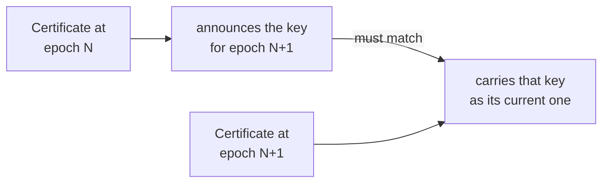

*The cross-epoch case.*

| Certificate under verification | Predecessor in the same epoch | Predecessor in the previous epoch |
| --- | --- | --- |
| Concatenation | The two current keys must be equal | The predecessor's announced next key must decode and equal the current key |
| Non-recursive SNARK | Both SNARK keys must be present and equal | The predecessor's announced next SNARK key must decode and equal the current SNARK key |

A value a rule needs and does not find is a rejection. The dispatch is on the flavor of the certificate under verification, not its predecessor's. Different next-epoch announcements do not fail this same-epoch check: the announcement is read only at the boundary.

A recursive certificate does not reach this check. Verification of one stops after its own integrity and proof checks and fetches no predecessor, because the verified recursive statement already covers the chain behind it; Part 5 states that contract. A chain walk that meets such a certificate stops there, whatever flavor it started from.

**Migration.** The announcement has to exist before it is needed, and in Pythagoras the production seed builder returns no next SNARK key. Switching era does not add one to a signed predecessor retroactively, so the first certificate needing a predecessor's SNARK announcement finds none unless it was already being produced. Once the signer data supports it, a Lagrange concatenation certificate can carry a next SNARK announcement and a non-recursive SNARK certificate in the following epoch can chain to it, so the flavor need not change in the same epoch as the era. Crossing an epoch, changing an era, changing aggregation flavor and establishing a new genesis are four different operations, and only the last creates a chain with no predecessor to satisfy.

## Registry publication, revocation, and re-genesis

Four operations act on circuit keys, with different actors, inputs and effects.

| Operation | Who | Effect |
| --- | --- | --- |
| Publish a registry | The holder of the network's genesis Ed25519 key | A newer signed list of permitted digests |
| Revoke an entry | The same | A digest stops being permitted |
| Replace circuit material | Circuit authors, then the release manager | New keys, new digests, a new distribution |
| Establish a new genesis | The operator | A chain with no predecessor |

**Publishing.** A registry is published per network, where that network's nodes can reach it. It takes effect only once a distribution carries the enforcement implementation and nodes are configured to resolve a source.

> **In review.** At the baseline the registry types, the signature and the certifier exist, but the standard certificate verifier has no registry dependency. Publication tooling arrives with PR #3541 at `c6f2e05`: an aggregator command exports the digests of a given protocol configuration and whitelists one in a signed registry. Enforcement and routing arrive with PR #3514 at `eaef674`: the aggregator takes a `circuit_verification_key_registry_url`, and the default client retriever resolves its network's registry from the published networks configuration. A baseline build with the feature enabled, a published registry and a configured source still enforces nothing.

**Revoking** is publishing with an entry marked revoked. It does not change a proof's bytes or the relation that proof satisfies; it changes acceptance. Once a verifier applies the registry, a certificate carrying a revoked digest is rejected, including one produced before the revocation was published — bounded by the entry's epoch range at the baseline, at every epoch in the reviewed revision, as Part 6 sets out. How quickly nodes act depends on the refresh policy. At `c6f2e05` a failed refresh keeps the last verified registry and schedules another attempt; if that verification is already older than the maximum age, the failed refresh rejects the check it lands on. The age limit does not bound how long the cached registry is served afterwards. Part 6 covers the branches. Neither revision gives a deadline by which a revocation is universally seen. Part 9 covers what an adversary gains in that window.

**Replacing circuit material and re-genesis.** Changing a circuit key requires a re-genesis of the certificate chain, for the reason Part 6 gives: a recursive chain's global anchor binds the verifying keys it started under, and no key-transition relation exists. The runbook's stages are:

1. Circuit authors update the golden verification keys and the committed production keys, and the integrity tests are run against them.
2. Reviewers confirm the circuit change is justified and that the circuit degree did not increase.
3. The release manager schedules the re-genesis alongside the distribution carrying the new circuit, environment by environment: testing, then pre-release, then the release networks.
4. A genesis ceremony establishes the new chain, after which the old chain is not continued.

Where the registry is enforced, the replacement keys also have to be permitted before certificates carrying them are accepted, so these steps are coordinated with stage 3 and not left until after it: export the digests for the target protocol parameters, authorize them in a newer signed registry, publish it, and point aggregators and clients at it. They belong to the in-review stack.

The [key-update runbook](https://github.com/IntersectMBO/mithril/blob/135243656d68b2da188c9c0473769313be6a539d/docs/runbook/update-circuit-keys/README.md) and the [manual-genesis runbook](https://github.com/IntersectMBO/mithril/blob/135243656d68b2da188c9c0473769313be6a539d/docs/runbook/genesis-manually/README.md) hold the commands and the environment ordering.

## Certificate consumption and client compatibility

Using a certificate takes two checks: the certificate is verified, and the data fetched is checked to be the data that certificate attests. The command-line client does both, verifying the chain in one step and then comparing the message it reconstructs from the downloaded artifact against the message in the certificate. The WASM client exposes them as separate calls. Chain verification does not catch a valid certificate for a different message.

**What changes with the flavor.** Each column is what verifying one certificate of that flavor requires.

| | Concatenation | Non-recursive SNARK | Recursive SNARK |
| --- | --- | --- | --- |
| Verification work | Grows with the signature set | One proof | One proof and its accumulator |
| Predecessors fetched | Walks predecessors to genesis | The same | None, after its own checks |
| Circuit verification keys | None | The certificate circuit's, carried by the certificate | Both circuits', carried by the certificate |
| Genesis chain anchor | Ed25519, verifying the genesis certificate | The same | Schnorr, verified inside the proof |
| Registry consulted | No | Yes, in review | Yes, in review |

A chain can mix flavors, and a client's requirements follow every certificate the walk reaches, not the one it starts from: walking back from a concatenation certificate can land on a recursive one, which stops the walk there and needs the Schnorr half and, under enforcement, certified circuit keys.

A client built without the SNARK feature cannot verify either SNARK flavor, and the rigid message variant is itself behind that feature. Backward compatibility of unchanged fields does not extend to a client understanding a rigid message or a proof, so a deployment plan needs the client versions in use, not only the aggregator's.

**Beyond the Mithril clients.** The published recursive proof carries a Blake2b transcript so it can be verified outside a circuit, which Part 5 explains, and the Mithril verifier already verifies it natively on that transcript. No on-chain or RISC0 verifier consuming it exists in this repository at the baseline.

# Part 9 — Security

The Mithril [threat model](https://mithril.network/doc/mithril/advanced/threat-model) is published on the website as a draft, and it predates SNARK aggregation. This part covers what SNARK certificates add to it: what an accepted certificate depends on, which of those dependencies are assumptions and which are checked, and what each requires of a deployment.

## What changes when a certificate becomes a proof

**Verification stops replaying the signatures.** A concatenation certificate carries the individual signatures, and a verifier recomputes each lottery and checks each signature itself. A SNARK certificate carries a proof that those checks passed. The verifier learns that a witness satisfying the relation existed. It does not see that witness and cannot re-derive the result; it can only check the proof.

**The primitives change.** Part 2 lists the substitutions, and each imports the security of what it brings in. Poseidon carries an assumption this part depends on: the lottery analysis models the chosen instantiation as producing independent uniform field outputs on distinct inputs, which is a model of the hash and not a proved property of it.

**The witness does not appear in the published proof.** The individual signatures, Merkle paths and winning indices the proof was built from are not in a SNARK certificate. The certificate's metadata still lists the signers whose submissions the aggregator received, so this is not contributor anonymity and the protocol claims none. That list is not an enumeration of the witness entries the deduplication finally selected.

**Circuit keys become an asset.** The threat model's existing assets are keys, configuration and chain data. A SNARK certificate adds the circuit verification keys: a proof verifies against a key, and whether that key is the intended one decides whether a verified proof means anything at all. Part 6 covers the registry that answers the question, and the next section covers what remains open.

## What the security argument rests on

A SNARK certificate inherits what the existing model assumes about authenticated registration, stake data and signer behaviour, and adds the four assumptions below, plus two authorities: the Schnorr genesis key the recursive circuit checks at its base case, in Parts 5 and 8, and the Ed25519 key signing the circuit key registry, in Part 6. A registry signature authenticates the decision to permit a circuit. It does not establish that the circuit is correct.

**The proof system is sound.** Both flavors use Halo2 with KZG commitments over BLS12-381. Soundness is computational: an efficient adversary succeeds only with negligible probability under the construction's assumptions, which is not the same as no accepting proof for a false statement existing. Reading an accepted certificate as evidence that the prover held the signatures needs the argument-of-knowledge property too. The recursive flavor adds the accumulation scheme, whose guarantee Part 5 states in the same terms.

**The trusted setup is honest, and the setup in use is the intended one.** The structured reference string comes from the Midnight ceremony at degree 22, and its SHA-256 hash is pinned in the crate. Knowledge of the ceremony's trapdoor breaks [soundness](#proof-system-terms) for every key derived from that setup, so the ceremony's condition — at least one honest participant, with verified updates — is the assumption being made here. The ceremony's own guarantees are outside this repository.

A prover verifies the string against the pinned hash when it downloads it and reuses the local copy afterwards, so a deployment gives that file the protection it gives the derived keys beside it. Verification needs neither: it uses the KZG parameters embedded in the crate.

**The circuit expresses the intended relation.** Soundness establishes that the circuit's constraints were satisfied. That those constraints express the protocol's rules is established by design, review and testing, which the next section covers.

**The circuit keys a verifier accepts are the intended ones.** At the baseline nothing certifies them: the standard verifier takes the keys from the certificate and consults no registry. Under the in-review enforcement it checks their digests against the genesis-signed registry, and Part 8 gives the refresh behaviour that decides when a published revocation reaches a given node.

Before a revocation is published and applied, what an adversary gains follows from why the key is revoked. If the circuit permits a protocol-invalid witness, a prover can produce a proof that verifies while violating the protocol, and a verifier that has not yet applied the revocation still authorizes the key identifying that circuit, so the certificate passes the registry check. It must still pass the proof and integrity checks, so continued authorization is not acceptance by itself. Once applied, revocation blocks later verifications and does not undo what was decided from certificates already accepted. Not every revoked circuit is exploitable, and the window has no established upper bound.

**Where testing fits.** These are the assumptions the security argument needs. Testing answers a different question — whether the implementation matches the design — and Part 7 gives the coverage: `MockProver` decides whether an assignment satisfies the constraints as implemented, and the negative tests exercise the violations the circuit is required to reject. Two runtime checks extend this into production: an aggregator verifies each certificate it creates, and verifies its own chain during its runtime cycle, so an inconsistency between proving and verification surfaces there as well as in CI.

## Underconstrained circuits

**The risk.** A circuit is underconstrained when it fails to enforce something the protocol requires. The proof system then behaves correctly and the verifier accepts: a prover produces a valid proof for a witness the protocol should have rejected — duplicate indices, too few signatures, a signature that does not verify. Nothing downstream detects it, because the proof is valid for the relation as written. The risk is introduced wherever constraints change, which includes a dependency upgrade that changes a gadget.

**Why tooling does not close it.** Static analysers for Halo2 circuits exist, `halo2-analyzer` and Veridise's Picus among them. The project's assessment found no practical integration with the Midnight stack: using one would mean porting the circuit or adapting the tool, and Midnight reported that Picus could not verify their own more complex circuits. It found no practical path to formalizing a full circuit in a proof assistant either, that option being reasonable for a circuit that is small and does not depend on a large context of other circuits. Audit cannot be run on every change.

**What is done instead.** Review with the problem explicitly in mind, and negative and property testing covering each check the circuit performs: signatures, message hash, witness length, duplicate indices, failed lotteries, Merkle path and root, epoch and parameters, and the public inputs. Part 7 records what those tests cover, and Parts 4 and 5 give the constraint sequences they exercise.

**Residual risk.** No evidence in this repository establishes that the circuits are fully constrained. The position is that review and negative testing are the best available approach until the tooling improves, and that it should be revisited as Midnight's work with Picus progresses.

## Proof of bound possession

**In review** at PR #3539, `559cdfb`, for issue #3537. Part 3 describes where it sits in registration.

**The problem.** The KES signature over a registration proves it came from that pool operator. It does not prove the registrant holds the signing key corresponding to the submitted Schnorr verification key, so a registrant can submit a key it does not control, including one another signer has already registered.

**The construction.** Two SHA-256 digests produce the value the registrant signs.

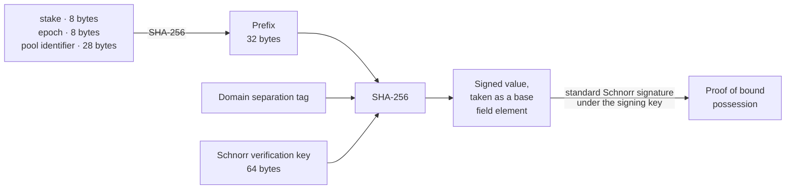

**What it establishes.** Possession, since only the holder of the signing key can produce the signature, and binding, since the signed value covers the stake, epoch and pool identifier, so a proof does not transfer to another identity, epoch or stake. The verifier recomputes both digests from its own stake distribution, its own current epoch and the pool identifier in the operational certificate, so the binding values are its view and not the registrant's claim. On that authenticated path a SNARK key without a valid proof is rejected; the lower STM registration API does not itself check one.

**Collision resolution.** Two registrations can still present the same SNARK key, so registration no longer treats that as an error. The two entries are compared on stake, then on the concatenation verification key as a deterministic tie-break, and only the lesser keeps the SNARK key; the other's SNARK key is dropped while its concatenation registration is left intact. One SNARK key therefore counts once towards registered SNARK stake, and a collision excludes no one from concatenation. Because the authenticated path requires a valid proof, a registrant cannot copy a published key it does not hold and use the tie-break to evict its owner, which is the property the tie-break needs. It does not follow that the submitting process holds the secret itself, nor that an operator cannot share a key across registrations it controls.

## What a signer can influence

Part 3 establishes that for a fixed registration, signing context and pool of candidate signatures, selection and deduplication are deterministic, and that re-randomising a signature changes neither its winning indices nor its ranking.

**The choice of key.** A signer's winning indices follow from its signing key and its committed target. Before registration closes it can compare candidate keys against any signing context it can predict, which includes the membership commitment, since a different candidate changes the registration tree. What the comparison is worth depends on how much of that context the signer can predict or influence before it commits. That the implementation resists re-randomising a nonce is a separate property and does not bound it.

**Withholding.** A signer can decline to submit its signature, which removes its contribution from the candidate pool. It cannot submit one and have only part of its wins counted: the aggregator recomputes every winning index from the signature it receives. Withholding need not change the selected set, since another signer may win the same index, but it reduces the pool the quorum is drawn from. Registration positions, which break the deduplication tie, are ordered by stake and then the concatenation key, so they are not freely chosen and not beyond influence either.

**The target approximation.** Part 3 derives the target through truncated series. Two quantities follow from it.

*Fairness* is how far a signer's real per-index probability, `(T + 1) / p` with the comparison inclusive, sits from the `q` its stake calls for. The implementation documents about 69 bits of series precision at `phi_f = 0.2`. That figure covers the series at that parameter. It is not a fairness bound across the parameters the protocol permits.

*Splitting* is how far the implemented probabilities depart from factorising. Under the ideal probability formula, splitting a stake across identities gains nothing, because the failure probability factorises exactly. The departure was measured at `phi_f = 0.2` with thirty terms, over four stake fractions and splits into two and into a hundred, giving residues of roughly `9 × 10⁻⁷⁸` to `2 × 10⁻⁵⁶`. That measurement used `T / p` rather than the inclusive `(T + 1) / p`, and the inclusive correction can change the sign of the smallest of them, so the historical sign pattern does not transfer unchanged. The magnitudes support only that the departure is small at those parameters. They bound nothing over other parameters or partitions, say nothing about key grinding, and need repeating if `phi_f` or the series length changes.

## Dependency audit status

The table separates dated audit confirmations from the dependency versions pinned at this baseline.

| | Reported status, 16 June 2026 |
| --- | --- |
| Who audited | ZkSecurity, three rounds covering the core circuit gadgets and the proving system; Veridise, covering the SHA-512 and RIPEMD-160 chips added later |
| Where the work is visible | The audit branches in the [midnight-zk repository](https://github.com/midnightntwrk/midnight-zk) |
| Are the reports public | No |
| What Mithril uses | Non-recursive: Jubjub, Poseidon, the range-check columns. Recursive: those plus the native, core-decomposition, BLS12-381 and SHA-256 configurations |
| What was confirmed | [8 January](https://github.com/IntersectMBO/mithril/issues/2802#issuecomment-3722491282): the components the non-recursive circuit uses are audited and fixed. [16 June](https://github.com/IntersectMBO/mithril/issues/3122#issuecomment-4715686613): the auditors and their scope, with the recursive circuit's in-circuit verifier gadget — the last of its four additional components to be outstanding — by then covered. The release tracks are addressed below |
| Pinned at this baseline | `midnight-circuits 7.2.2`, `midnight-curves 0.3.1`, `midnight-proofs 0.8.1`, `midnight-zk-stdlib 2.3.3`, all exact-version pins |

The confirmation is at release-track granularity. The June discussion names standard-library versions 1.2.0 and 2.3.0 where this baseline pins 2.3.3, so it covers the track and each later patch inherits it. These are statements from the auditors and the library's maintainers; the reports themselves are not public, and their scope is the library, not the circuits Mithril builds on it. The 2.x track was [described](https://github.com/IntersectMBO/mithril/issues/3122#issuecomment-4715891520) at that date as a minor release adding standard-library gadgets and leaving the proving system unchanged; the optimisation work that would change it was [reported](https://github.com/IntersectMBO/mithril/issues/3122#issuecomment-4716425091) as not yet released.

**How a change is detected.** The versions are exact pins, so an upgrade is an explicit reviewed edit. The circuit verification key digest fingerprints the constraint system, and a golden test compares it against a committed value, so a dependency change altering the derived key for the tested configuration fails that test. A change that leaves those bytes identical — in witness generation, host validation or verifier behaviour — falls to review, and audit coverage is the separate question recorded above. Part 6 covers the digest and Part 7 the tests.
